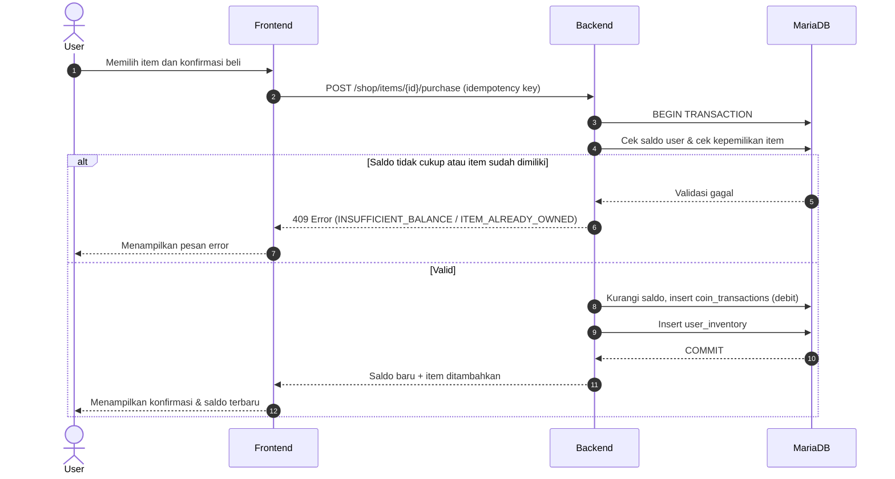
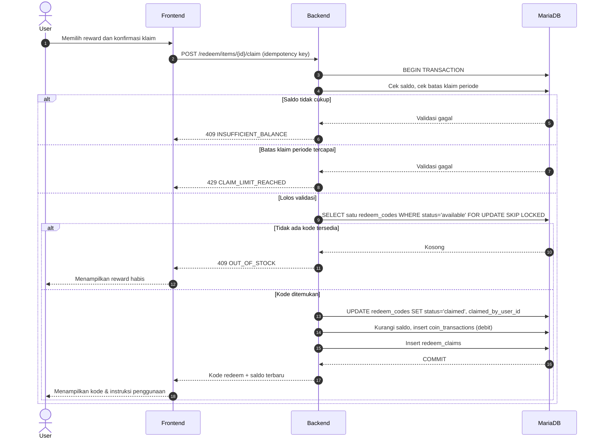
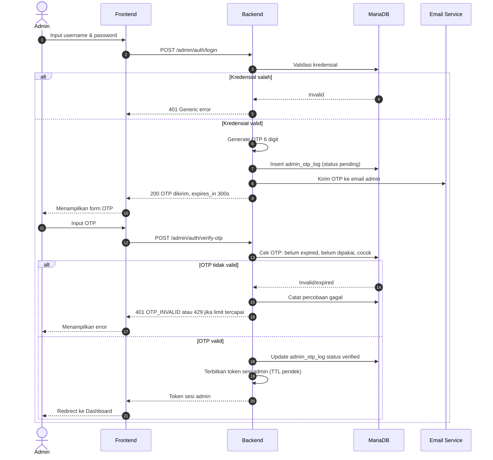
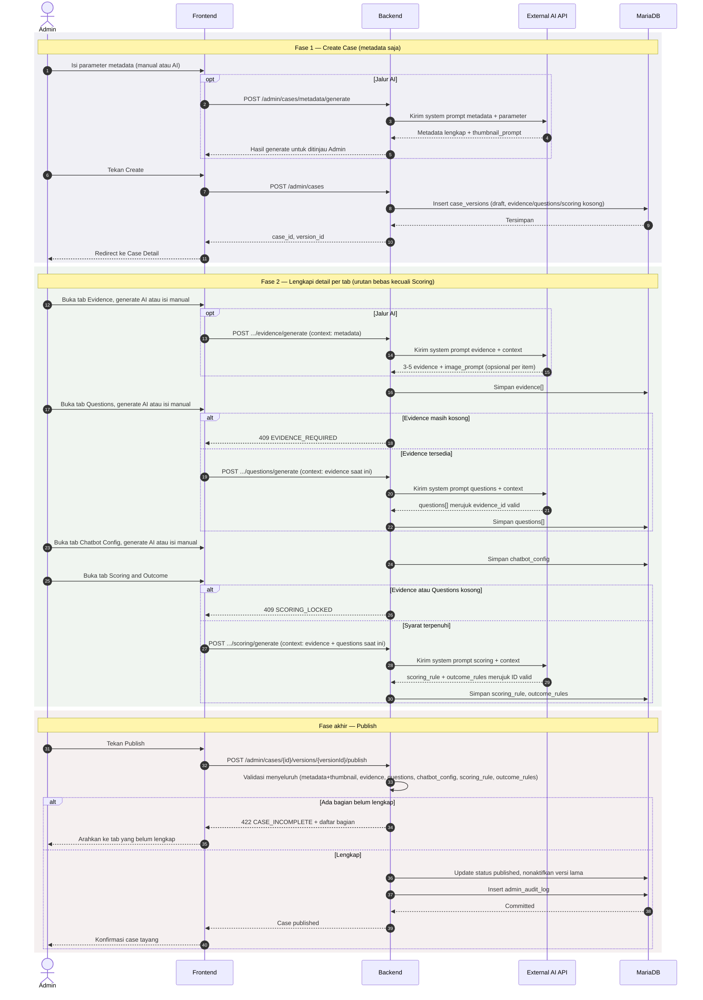

# Software Requirements Specification (SRS)
## KODEKABI: Jejak Algoritma

**Disusun mengikuti kerangka standar IEEE 830-1998 / ISO/IEC/IEEE 29148:2018**

| | |
|---|---|
| **Versi Dokumen** | 2.0 (Konsolidasi) |
| **Status** | Draft untuk Review Teknis |
| **Tanggal** | 24 Juli 2026 (revisi konsolidasi terakhir mengikuti pembahasan Shop & Redeem serta Admin Console) |
| **Dokumen Induk** | PRD KODEKABI: Jejak Algoritma v2.0 (Konsolidasi) |
| **Audiens** | Backend Engineer, Frontend Engineer, QA Engineer, AI/ML Engineer, Database Administrator |

---

## Riwayat Revisi

| Versi | Tanggal | Disusun Oleh | Deskripsi |
|---|---|---|---|
| 1.0 | 24 Jul 2026 | Tim Produk & Engineering KODEKABI | SRS awal diturunkan dari PRD v1.0 dan Dokumen Konsep Produk, dengan detail teknis tambahan (use case, data dictionary, API schema) |
| 2.0 | 24 Jul 2026 | Tim Produk & Engineering KODEKABI | Konsolidasi `SRS_KODEKABI_Shop_Redeem_Addendum.md` dan `SRS_KODEKABI_Admin_Console_Addendum.md` ke dokumen ini (Bagian 12). Revisi role `content_author` digabung ke `admin` (2.3, SRS-AUTH-006, data dictionary `users.role`); UC-12 digantikan UC-18; 2FA wajib untuk login admin; CMS Case tanpa tahap review terpisah; skema evidence tanpa field avatar; thumbnail case wajib per-case. |

> **Catatan Penting:** SRS ini adalah dokumen turunan teknis dari PRD KODEKABI: Jejak Algoritma. Setiap requirement fungsional (FR-xxx pada PRD) diterjemahkan di sini menjadi satu atau lebih *software requirement* formal berformat **SRS-[MODUL]-[NOMOR]** yang bersifat "shall" (wajib, dapat diverifikasi, dapat diuji). Bagian yang ditandai **[DIUSULKAN]** adalah detail teknis tambahan yang disusun mengikuti praktik umum SRS karena belum dirinci secara eksplisit pada dokumen sumber, dan **wajib dikonfirmasi bersama tim engineering** sebelum diimplementasikan sebagai kontrak final (khususnya skema JSON, kode error, dan tipe data).

---

## Daftar Isi

1. [Pendahuluan](#1-pendahuluan)
2. [Deskripsi Umum Sistem](#2-deskripsi-umum-sistem)
3. [Requirement Antarmuka Eksternal](#3-requirement-antarmuka-eksternal)
4. [Spesifikasi Use Case](#4-spesifikasi-use-case)
5. [Software Requirements per Fitur/Modul](#5-software-requirements-per-fiturmodul)
6. [Requirement Data (Data Dictionary)](#6-requirement-data-data-dictionary)
7. [Requirement Non-Fungsional Rinci](#7-requirement-non-fungsional-rinci)
8. [Aturan Bisnis (Business Rules)](#8-aturan-bisnis-business-rules)
9. [Model Analisis (State & Sequence)](#9-model-analisis-state--sequence)
10. [Matriks Ketertelusuran (Traceability Matrix)](#10-matriks-ketertelusuran-traceability-matrix)
11. [Lampiran](#11-lampiran)
12. [Modul Tambahan — Shop, Redeem, dan Admin Console](#12-modul-tambahan--shop-redeem-dan-admin-console)

---

## 1. Pendahuluan

### 1.1 Tujuan Dokumen
Dokumen ini menetapkan spesifikasi kebutuhan perangkat lunak (software requirements) secara rinci dan dapat diverifikasi untuk sistem **KODEKABI: Jejak Algoritma** — sebuah game simulasi investigasi digital berbasis web. SRS ini menjadi kontrak teknis antara tim produk dan tim engineering (backend, frontend, AI, QA) untuk memastikan seluruh pihak memiliki pemahaman yang identik mengenai *apa* yang harus dibangun sistem, sebelum desain rinci dan implementasi dimulai.

### 1.2 Konvensi Dokumen
- Setiap requirement diberi ID unik dengan format `SRS-[MODUL]-[NOMOR]`, contoh: `SRS-AUTH-001`.
- Kata **"harus" / "wajib" (shall)** menandakan requirement mandatory yang wajib diimplementasikan dan dapat diverifikasi melalui pengujian.
- Kata **"sebaiknya" (should)** menandakan requirement yang sangat direkomendasikan tetapi dapat dinegosiasikan berdasarkan kapasitas sprint.
- Kata **"dapat" (may)** menandakan requirement opsional/nice-to-have.
- Setiap requirement fungsional mencantumkan referensi ke ID requirement PRD terkait (lihat Bagian 10 — Traceability Matrix) untuk menjamin tidak ada kebutuhan bisnis yang hilang saat diterjemahkan menjadi spesifikasi teknis.
- Skema data dan API ditulis dalam notasi JSON Schema/JSON contoh; tipe data mengikuti konvensi Go (`string`, `int64`, `float64`, `bool`, `timestamp` (RFC3339), `uuid`).

### 1.3 Audiens dan Cara Membaca Dokumen
| Peran | Bagian yang Relevan |
|---|---|
| Backend Engineer (Go) | Bagian 3.4 (API), Bagian 5 (Requirements per modul), Bagian 6 (Data Dictionary), Bagian 8 (Business Rules) |
| Frontend Engineer (Next.js/React) | Bagian 3.1 (UI), Bagian 4 (Use Case), Bagian 5, Bagian 9 (State Diagram) |
| AI/ML Engineer | Bagian 3.3 (Software Interfaces — AI API), Bagian 5.7 (Chatbot & Scoring), Bagian 8 |
| QA Engineer | Bagian 4 (Use Case sebagai basis test case), seluruh Acceptance Criteria pada Bagian 5 |
| Database Administrator | Bagian 6 (Data Dictionary), Bagian 9.1 (ERD naratif) |

### 1.4 Lingkup Produk
KODEKABI: Jejak Algoritma adalah aplikasi web (dengan dukungan PWA/offline-first parsial) yang terdiri atas:
- **Frontend** berbasis Next.js/React/PixiJS yang menjalankan satu *gameplay shell* generik untuk seluruh case investigasi.
- **Backend** berbasis Go (arsitektur modular monolith) yang mengelola sepuluh modul domain: Auth, User, City, Case, Session, Answer, Chatbot, Scoring, Progression, Leaderboard.
- **Data store**: MariaDB (source of truth transaksional), Redis (cache/queue/rate-limit), Object Storage kompatibel S3 (aset media).
- **Integrasi AI eksternal** untuk chatbot kontekstual dan evaluasi semantik jawaban terbuka, dengan batasan tegas bahwa AI tidak pernah menentukan skor akhir.

Lingkup SRS ini mencakup seluruh fitur MVP sebagaimana didefinisikan pada PRD Bagian 5.1, ditambah detail teknis pendukungnya (validasi field, kode error, state transition, skema data).

### 1.5 Definisi, Akronim, dan Singkatan

| Istilah | Definisi |
|---|---|
| SRS | Software Requirements Specification |
| PRD | Product Requirements Document |
| FR | Functional Requirement (ID pada PRD, format MODUL-NN) |
| API | Application Programming Interface |
| REST | Representational State Transfer |
| JWT | JSON Web Token |
| CRUD | Create, Read, Update, Delete |
| PWA | Progressive Web Application |
| IDB | IndexedDB (penyimpanan browser sisi klien) |
| p95 | Persentil ke-95 dari distribusi suatu metrik (mis. latensi) |
| UC | Use Case |
| ERD | Entity Relationship Diagram |
| MVP | Minimum Viable Product |
| RBAC | Role-Based Access Control |
| TTL | Time To Live |
| Snapshot Case | Salinan versi case yang dikunci pada saat sesi dimulai |
| Bounded Context (AI) | Kumpulan data terbatas dan tervalidasi yang dikirim ke AI eksternal sebagai prompt |

### 1.6 Referensi
- Dokumen Konsep Produk "KODEKABI: Jejak Algoritma" (dokumen sumber yang diunggah pengguna untuk konteks UNESCO Youth Hackathon).
- Product Requirements Document (PRD) KODEKABI: Jejak Algoritma v1.0 (dokumen induk SRS ini).
- IEEE Std 830-1998 — Recommended Practice for Software Requirements Specifications.
- ISO/IEC/IEEE 29148:2018 — Systems and software engineering — Life cycle processes — Requirements engineering.

---

## 2. Deskripsi Umum Sistem

### 2.1 Perspektif Produk
KODEKABI adalah sistem baru (bukan pengembangan dari sistem lama), terdiri atas satu aplikasi web client (PWA) yang berkomunikasi dengan satu backend modular monolith melalui REST API di atas HTTPS. Sistem bergantung pada satu layanan eksternal (AI API) yang perannya dibatasi eksplisit agar sistem tetap dapat berjalan penuh tanpa layanan tersebut (graceful degradation via fallback).

**Diagram Konteks Sistem (naratif):**

```
                     ┌─────────────────────────┐
                     │   Pengguna (Auditor)     │
                     └────────────┬─────────────┘
                                  │ HTTPS
                     ┌────────────▼─────────────┐
                     │  Frontend (Next.js/React/ │
                     │  PixiJS) — PWA + IndexedDB │
                     └────────────┬─────────────┘
                                  │ REST API (JSON/HTTPS)
                     ┌────────────▼─────────────┐
                     │   Backend Go (Modular      │
                     │   Monolith): 10 domain      │
                     │   module                    │
                     └──┬──────┬──────┬──────┬────┘
                        │      │      │      │
                 ┌──────▼┐ ┌───▼───┐ ┌▼─────┐ ┌▼────────────┐
                 │MariaDB│ │ Redis │ │ S3   │ │External AI  │
                 │(source│ │(cache,│ │Object│ │API (chatbot,│
                 │of     │ │queue, │ │Storage│ │semantic     │
                 │truth) │ │RL)    │ │      │ │evaluation)  │
                 └───────┘ └───────┘ └──────┘ └─────────────┘
```

### 2.2 Fungsi Utama Produk (Ringkasan)
1. Registrasi, autentikasi, dan manajemen profil pengguna.
2. Visualisasi kondisi kota (City Dashboard) berbasis statistik agregat.
3. Katalog dan seleksi case investigasi dengan sistem prasyarat (unlocking).
4. Investigasi case: membuka evidence, menjawab pertanyaan multi-tipe, berinteraksi dengan chatbot kontekstual.
5. Penilaian perilaku investigasi secara deterministik (rule-based) dibantu sinyal semantik AI.
6. Penyajian hasil (konsekuensi, skor, dampak kota) dan pembaruan progres (XP, level, reputasi).
7. Leaderboard dan mekanisme retensi berbasis rekomendasi case.
8. (Fase lanjutan) Alat bantu penyusunan case oleh content author dengan asistensi AI.

### 2.3 Kelas dan Karakteristik Pengguna

*(Direvisi — role `content_author` digabung ke `admin`; lihat Bagian 12.3 untuk Auth Admin dengan 2FA.)*

| Kelas Pengguna | Karakteristik | Frekuensi Interaksi | Hak Akses Sistem |
|---|---|---|---|
| **Player (Auditor Digital)** | Usia 15–24 tahun, familiar dengan aplikasi mobile/web dan chatbot AI, kemampuan teknis operasional dasar | Tinggi — beberapa kali per minggu | Registrasi, gameplay penuh, profil sendiri, leaderboard (read), Shop & Redeem |
| **Admin** | Tim inti produk/engineering, mengelola seluruh sisi produksi konten dan operasional | Rendah–sedang, tergantung tahap produk | Akses penuh: publikasi case (termasuk AI-assisted case authoring), manajemen role, moderasi konten, CMS Shop & Redeem, dashboard operasional, konfigurasi game, audit log — lihat Bagian 12.3 |
| **Pengguna Sekunder (Guru/Fasilitator)** | Tidak wajib berinteraksi langsung dengan gameplay; melihat hasil agregat | Rendah–sedang | *(Fase pasca-MVP)* Akses dashboard kompetensi kelompok (read-only) |

### 2.4 Lingkungan Operasi
- **Client:** Browser modern (Chrome, Edge, Safari, Firefox versi dua tahun terakhir) di desktop dan mobile; instalasi sebagai PWA opsional.
- **Server:** Layanan backend Go dikemas sebagai container, dijalankan pada lingkungan cloud/on-premise yang mendukung Linux x86_64/ARM64.
- **Database:** MariaDB versi stabil terbaru yang mendukung tipe kolom JSON.
- **Cache:** Redis versi stabil terbaru mendukung struktur data string, hash, sorted set (untuk leaderboard), dan pub/sub (opsional untuk invalidation).
- **Object Storage:** Kompatibel S3 API (mis. MinIO, AWS S3, atau setara).
- **AI API:** Layanan HTTPS eksternal (vendor atau open-source endpoint self-hosted) yang mendukung request/response berbasis JSON dengan dukungan timeout dan streaming opsional.

### 2.5 Batasan Desain dan Implementasi
- **DIC-01:** Backend wajib diimplementasikan sebagai *modular monolith* dalam satu basis kode Go, dengan boundary domain yang jelas antar-modul (bukan microservices) pada fase MVP.
- **DIC-02:** AI eksternal tidak boleh diberi akses langsung ke database atau ke input mentah pengguna; seluruh interaksi AI wajib melalui *bounded context* yang dibangun dan divalidasi backend.
- **DIC-03:** Seluruh mutasi data (create/update pada Session, Answer, Submission) wajib bersifat idempotent melalui idempotency key yang dikirim client.
- **DIC-04:** Skema case (briefing, evidence, questions, scoring rule, outcome) wajib disimpan dalam struktur data generik yang seragam lintas case, agar frontend tidak memerlukan komponen unik per case.
- **DIC-05:** Query SQL wajib dihasilkan melalui `sqlc` (type-safe code generation), migrasi skema wajib melalui `goose`.
- **DIC-06:** Draft jawaban pengguna wajib tersimpan di IndexedDB sisi klien sebelum dikirim ke server, untuk mendukung mode low-connectivity.

### 2.6 Asumsi dan Dependensi
- Diasumsikan tersedia kredensial dan endpoint AI API (vendor/open-source) sebelum modul Chatbot dan Scoring semantic evaluation diimplementasikan penuh.
- Diasumsikan tim backend memiliki keahlian Go, dan tim frontend memiliki keahlian Next.js/React sejak awal proyek (tidak ada ramp-up teknologi baru pada fase MVP).
- Sistem bergantung pada ketersediaan layanan cloud (compute, storage, database terkelola atau self-hosted) yang mendukung deployment container.
- Aturan skor (scoring rule) per case diasumsikan didefinisikan oleh content author/product owner sebagai bagian dari data case, bukan hardcode di kode aplikasi.

---
## 3. Requirement Antarmuka Eksternal

### 3.1 Antarmuka Pengguna (User Interfaces)

#### 3.1.1 Layar: City Dashboard
| Elemen | Spesifikasi |
|---|---|
| Komponen wajib | 5 kartu statistik (Information Health, Public Trust, Social Stability, Public Wellbeing, Auditor Reputation), indikator level & XP, carousel/list case, notifikasi dampak keputusan terakhir |
| Rentang nilai statistik | Integer 0–100 dengan 3 status warna: **Aman** (≥70, hijau), **Terancam** (40–69, kuning), **Kritis** (<40, merah) |
| Perilaku loading | Skeleton loading maksimum 2 detik sebelum menampilkan data; jika API gagal, tampilkan state error dengan tombol retry |
| Navigasi | Tab/menu ke: Profil, Case History, Leaderboard *(fase 3)*, Logout |

#### 3.1.2 Layar: Case Selection
| Elemen | Spesifikasi |
|---|---|
| Case card wajib menampilkan | Thumbnail (rasio 16:9), judul (maks. 60 karakter), badge jenis sumber, badge risk level (Rendah/Sedang/Tinggi), estimasi durasi (menit), status (Tersedia/Terkunci/Selesai) |
| Case terkunci | Overlay semi-transparan + ikon gembok + tooltip syarat pembuka (mis. "Butuh Level 3") |
| Interaksi | Tap/klik pada card membuka preview modal sebelum tombol "Mulai Investigasi" aktif |

#### 3.1.3 Layar: Investigation Screen (Tiga Kolom)
| Kolom | Lebar | Perilaku Responsif (mobile < 768px) |
|---|---|---|
| Kiri (Case Overview & Evidence List) | ≈15% desktop | Menjadi drawer collapsible yang dapat dibuka via tombol ikon |
| Tengah (Konten Evidence) | ≈50% desktop | Full-width, scroll vertikal |
| Kanan (Pertanyaan & Chatbot) | ≈35% desktop | Menjadi tab terpisah ("Pertanyaan" / "Chatbot") di bawah konten tengah |

Elemen kontrol wajib pada kolom kanan: confidence slider (0–100%, snap tiap 5%), radio/checkbox untuk structured choice, dropdown/chip untuk claim classification, textarea dengan counter karakter untuk open question (limit 500 karakter, minimum 20 karakter jika wajib diisi), tombol "Tanya Chatbot", indikator status simpan draft ("Tersimpan" / "Menyimpan..." / "Gagal — akan dicoba ulang").

#### 3.1.4 Layar: Final Submission Summary
Menampilkan daftar seluruh pertanyaan dengan indikator status (✓ Terjawab / ⚠ Belum Lengkap). Tombol "Kirim Keputusan Akhir" nonaktif (disabled) selama ada item ⚠. Setelah ditekan, tombol berubah menjadi state loading dan dinonaktifkan untuk mencegah double-submit (lihat SRS-ANSWER-006).

#### 3.1.5 Layar: Result Screen
Urutan tampil (top-to-bottom), sesuai PRD Bagian 8.5: (1) narasi konsekuensi, (2) penjelasan keputusan, (3) score breakdown 5 dimensi (bentuk radar chart atau bar chart), (4) feedback naratif (1 kekuatan + 1 area perbaikan), (5) animasi perubahan city stats (before → after), (6) XP bar dengan animasi pertambahan, (7) badge reputasi, (8) kartu rekomendasi case berikutnya.

### 3.2 Antarmuka Perangkat Keras (Hardware Interfaces)
Sistem tidak memiliki requirement perangkat keras khusus. Sistem harus dapat berjalan pada perangkat client standar (smartphone, tablet, laptop) dengan:
- Layar minimum 320px (lebar viewport terkecil yang didukung).
- Kamera/mikrofon **tidak** digunakan pada MVP.
- Local storage browser (IndexedDB) minimum tersedia ~50MB untuk cache case dan draft jawaban.

### 3.3 Antarmuka Perangkat Lunak (Software Interfaces)

| Sistem Eksternal | Protokol | Tujuan Integrasi | Format Data |
|---|---|---|---|
| MariaDB | TCP (native MySQL protocol) via driver Go (`database/sql` + driver kompatibel) | Source of truth seluruh entitas transaksional | Tabel relasional + kolom JSON untuk konfigurasi fleksibel |
| Redis | TCP (RESP protocol) | Cache dashboard/leaderboard, rate limiting, distributed lock, queue proses AI async | Key-value, hash, sorted set |
| Object Storage (S3-compatible) | HTTPS (S3 API — `PutObject`, `GetObject`) | Penyimpanan thumbnail, background kota, avatar, aset PixiJS | Binary (image/audio) + metadata |
| External AI API | HTTPS REST (JSON) | Contextual chatbot, semantic evaluation jawaban terbuka, draft case generation | JSON request/response, lihat 3.3.1 |

#### 3.3.1 Kontrak Integrasi AI API [DIUSULKAN — perlu dikonfirmasi sesuai vendor final]

**Request (Chatbot):**
```json
{
  "case_id": "uuid",
  "session_id": "uuid",
  "persona": "string (deskripsi persona chatbot dalam case)",
  "knowledge_boundary": ["string", "..."],
  "prohibited_topics": ["string", "..."],
  "allowed_evidence": [{"evidence_id": "uuid", "summary": "string"}],
  "conversation_history": [{"role": "user|assistant", "content": "string"}],
  "user_message": "string (maks. 500 karakter, sudah disanitasi)"
}
```

**Response (Chatbot) — sukses:**
```json
{
  "status": "ok",
  "reply": "string",
  "flags": { "out_of_context_attempt": false, "requires_human_review": false }
}
```

**Response (Chatbot) — gagal/timeout:** backend tidak meneruskan error mentah ke frontend; backend mengganti dengan fallback response internal (lihat SRS-CHATBOT-005) dan mencatat kegagalan untuk metrik `AI Fallback Rate`.

**Request (Semantic Evaluation Open Question):**
```json
{
  "case_id": "uuid",
  "question_id": "uuid",
  "rubric": { "criteria": ["string", "..."] },
  "player_answer": "string",
  "bounded_context": "string (ringkasan case terbatas)"
}
```

**Response (Semantic Evaluation) — sukses:**
```json
{
  "status": "ok",
  "signals": {
    "acknowledges_uncertainty": true,
    "considers_risk": false,
    "distinguishes_experience_vs_evidence": true,
    "uses_relevant_reasoning": true,
    "overgeneralizes": false,
    "requires_human_review": false
  }
}
```

Timeout default untuk seluruh panggilan AI API: **5 detik** (chatbot) dan **8 detik** (semantic evaluation), dapat dikonfigurasi melalui environment variable backend. Melewati timeout memicu fallback (lihat SRS-CHATBOT-005, SRS-SCORING-002).

### 3.4 Antarmuka Komunikasi (Communication Interfaces / REST API)

**Konvensi umum:**
- Base path: `/api/v1`
- Format: JSON (`Content-Type: application/json`) untuk request & response.
- Autentikasi: header `Authorization: Bearer <JWT>` pada seluruh endpoint kecuali `POST /auth/register` dan `POST /auth/login`.
- Idempotency: header `Idempotency-Key: <uuid>` wajib pada seluruh endpoint mutasi (`PUT`, `POST` yang mengubah state).
- Error response terstandarisasi:
```json
{ "error": { "code": "STRING_ERROR_CODE", "message": "Pesan yang aman ditampilkan ke pengguna", "details": {} } }
```

#### 3.4.1 `POST /api/v1/auth/register`
| | |
|---|---|
| Auth | Tidak |
| Request Body | `{ "username": "string(3-20)", "avatar_id": "string", "age_range": "13-15\|16-18\|19-24\|25+", "consent": true }` |
| Response 201 | `{ "user_id": "uuid", "username": "string", "token": "string", "refresh_token": "string" }` |
| Error 409 | `USERNAME_TAKEN` |
| Error 422 | `VALIDATION_ERROR` (mis. consent = false) |

#### 3.4.2 `POST /api/v1/auth/login`
| | |
|---|---|
| Auth | Tidak |
| Request Body | `{ "username": "string", "password": "string" }` |
| Response 200 | `{ "token": "string", "refresh_token": "string", "expires_in": 3600 }` |
| Error 401 | `INVALID_CREDENTIALS` (pesan generik, tidak membedakan username/password salah) |
| Error 429 | `RATE_LIMITED` |

#### 3.4.3 `POST /api/v1/auth/logout`
| | |
|---|---|
| Auth | Wajib |
| Response 200 | `{ "status": "logged_out" }` |
| Efek Samping | Token & refresh token diinvalidasi di backend (masuk denylist Redis hingga expiry alami) |

#### 3.4.4 `GET /api/v1/dashboard`
| | |
|---|---|
| Auth | Wajib |
| Response 200 | `{ "profile": {...}, "city_state": {...}, "progress": {...}, "case_catalog": [ {...} ] }` |
| Sumber Data | Query gabungan User, City, Progress, Case module; dilayani dari Redis cache dengan TTL 60 detik, invalidasi paksa setelah `POST /sessions/{id}/submit` sukses |

#### 3.4.5 `POST /api/v1/cases/{caseId}/sessions`
| | |
|---|---|
| Auth | Wajib |
| Response 201 | `{ "session_id": "uuid", "session_version": 1, "briefing": {...}, "evidence_index": [...], "questions": [...] }` |
| Error 403 | `CASE_LOCKED` — case belum memenuhi prasyarat |
| Error 404 | `CASE_NOT_FOUND` |
| Error 409 | `SESSION_ALREADY_ACTIVE` — sesi aktif lain untuk case yang sama sudah ada |

#### 3.4.6 `PUT /api/v1/sessions/{id}/answers`
| | |
|---|---|
| Auth | Wajib |
| Request Body | `{ "session_version": 3, "answers": [ { "question_id": "uuid", "type": "structured_choice\|confidence\|claim_classification\|open_question", "value": "..." } ] }` |
| Response 200 | `{ "session_version": 4, "saved_at": "timestamp" }` |
| Error 409 | `SESSION_VERSION_CONFLICT` — client diminta refresh state |
| Error 422 | `INVALID_ANSWER_TYPE` |

#### 3.4.7 `POST /api/v1/sessions/{id}/events`
| | |
|---|---|
| Auth | Wajib |
| Request Body | `{ "session_version": 4, "event_type": "evidence_opened", "evidence_id": "uuid" }` |
| Response 200 | `{ "evidence_content": {...} }` |
| Error 422 | `INVALID_EVIDENCE_REFERENCE` |

#### 3.4.8 `POST /api/v1/sessions/{id}/chat`
| | |
|---|---|
| Auth | Wajib |
| Request Body | `{ "session_version": 5, "message": "string(max 500)" }` |
| Response 200 | `{ "reply": "string", "is_fallback": false }` |
| Rate Limit | Maks. 20 pesan per sesi per case (mencegah abuse & biaya AI berlebih) — `RATE_LIMITED` jika terlampaui |

#### 3.4.9 `GET /api/v1/sessions/{id}/submission-summary`
| | |
|---|---|
| Auth | Wajib |
| Response 200 | `{ "completion_status": "incomplete\|ready", "missing_fields": ["question_id", "..."], "answers_preview": [...] }` |

#### 3.4.10 `POST /api/v1/sessions/{id}/submit`
| | |
|---|---|
| Auth | Wajib |
| Request Body | `{ "session_version": 6, "final_decision": "string", "final_confidence": 0-100, "reasoning": "string" }` |
| Response 200 | `{ "outcome": {...}, "score_breakdown": {...}, "city_impact": {...}, "xp_gained": 120, "level_up": false, "next_case_recommendation": {...} }` |
| Error 409 | `SESSION_VERSION_CONFLICT` atau `ALREADY_SUBMITTED` |
| Error 422 | `INCOMPLETE_SUBMISSION` |
| Idempotency | Request dengan `Idempotency-Key` yang sama mengembalikan response tersimpan sebelumnya tanpa memproses ulang scoring |

#### 3.4.11 `GET /api/v1/leaderboard` *(Fase 3)*
| | |
|---|---|
| Auth | Wajib |
| Query Param | `?scope=weekly\|cohort&cohort_id=uuid` |
| Response 200 | `{ "entries": [ { "rank": 1, "username": "string", "avatar_id": "string", "score": 4200 } ] }` |
| Sumber Data | Redis sorted set, tidak melakukan query langsung ke MariaDB |

---
## 4. Spesifikasi Use Case

Setiap use case berikut menjadi basis langsung bagi test case QA. Diagram konteks: seluruh use case dipicu oleh aktor **Player**, kecuali dinyatakan lain.

### UC-01 — Registrasi Akun Auditor
| | |
|---|---|
| **Aktor** | Player (pengguna baru) |
| **Trigger** | Pengguna menekan tombol "Buat Akun" pada landing page |
| **Precondition** | Pengguna belum memiliki akun; pengguna telah membaca kebijakan privasi |
| **Postcondition (sukses)** | Akun baru tersimpan dengan status aktif; pengguna otomatis login (token diterbitkan) |
| **Related FR** | AUTH-01, AUTH-06 |

**Alur Utama:**
1. Sistem menampilkan form registrasi (username, pilihan avatar, rentang usia, checkbox consent).
2. Pengguna mengisi seluruh field dan menekan "Daftar".
3. Frontend memvalidasi format field secara lokal (username 3–20 karakter alfanumerik, avatar dipilih, consent = true).
4. Frontend mengirim `POST /auth/register`.
5. Backend memvalidasi keunikan username terhadap tabel `users`.
6. Backend membuat record `users` dan `user_profiles` baru dengan level=1, xp=0.
7. Backend menerbitkan token & refresh token, mengembalikan response 201.
8. Frontend menyimpan token, mengarahkan pengguna ke alur Onboarding/Tutorial.

**Alur Alternatif:**
- 3a. Validasi lokal gagal → frontend menampilkan pesan error inline per field, tidak mengirim request.
- 5a. Username sudah dipakai → backend mengembalikan `409 USERNAME_TAKEN` → frontend menampilkan pesan "Username sudah digunakan, coba yang lain."

**Alur Eksepsi:**
- 4a. Kegagalan jaringan → frontend menampilkan retry banner, form tetap terisi (tidak hilang).

---

### UC-02 — Login
| | |
|---|---|
| **Aktor** | Player (pengguna terdaftar) |
| **Precondition** | Pengguna memiliki akun aktif |
| **Postcondition (sukses)** | Token & refresh token tersimpan di client; pengguna diarahkan ke City Dashboard |
| **Related FR** | AUTH-02, AUTH-03 |

**Alur Utama:**
1. Pengguna mengisi username & password, menekan "Masuk".
2. Frontend mengirim `POST /auth/login`.
3. Backend memvalidasi kredensial.
4. Backend menerbitkan token (masa berlaku 1 jam) & refresh token (masa berlaku 30 hari).
5. Frontend menyimpan token, redirect ke City Dashboard (UC-03).

**Alur Eksepsi:**
- 3a. Kredensial salah → `401 INVALID_CREDENTIALS`, pesan generik ditampilkan (tidak membedakan username/password yang salah — lihat SRS-AUTH-002).
- 3b. Percobaan gagal >5 kali dalam 15 menit → `429 RATE_LIMITED`.

---

### UC-03 — Melihat City Dashboard
| | |
|---|---|
| **Aktor** | Player |
| **Trigger** | Login sukses, atau navigasi kembali dari layar lain |
| **Precondition** | Token valid |
| **Postcondition** | Kondisi kota, profil, dan case catalog terkini ditampilkan |
| **Related FR** | CITY-01, CITY-02, USER-01 |

**Alur Utama:**
1. Frontend mengirim `GET /dashboard`.
2. Backend memvalidasi token (jika tidak valid → 401, frontend redirect ke login).
3. Backend mengambil city state, profil pengguna, progress, dan case catalog (dari cache Redis jika tersedia, TTL 60 detik).
4. Backend mengembalikan payload gabungan.
5. Frontend merender 5 kartu statistik, level/XP, dan daftar case.

**Alur Alternatif:**
- 3a. Cache kosong/kedaluwarsa → backend query MariaDB langsung, lalu menulis ulang ke cache.

---

### UC-04 — Memilih dan Memulai Case
| | |
|---|---|
| **Aktor** | Player |
| **Precondition** | Case berstatus "Tersedia" (tidak terkunci) |
| **Postcondition (sukses)** | Session baru dibuat dengan snapshot case; frontend menampilkan Investigation Screen dengan state awal |
| **Related FR** | CASE-01, CASE-03, CASE-04, SESSION-01 |

**Alur Utama:**
1. Pengguna menekan case card → preview modal muncul.
2. Pengguna menekan "Mulai Investigasi".
3. Frontend mengirim `POST /cases/{caseId}/sessions`.
4. Backend memvalidasi: case ada & published, prasyarat (level/reputasi/case lain) terpenuhi, tidak ada sesi aktif lain untuk case yang sama oleh pengguna ini.
5. Backend membuat snapshot versi case (salinan briefing/evidence/questions/scoring rule pada versi saat ini) dan record `sessions` baru dengan `session_version = 1`.
6. Backend mengembalikan briefing, evidence index (metadata saja, bukan isi penuh), dan daftar questions.
7. Frontend menampilkan layar briefing → pengguna mengisi initial judgment & confidence (UC-06 varian awal) → frontend menampilkan Investigation Screen.

**Alur Alternatif:**
- 4a. Case terkunci → `403 CASE_LOCKED` → frontend menampilkan alasan (mis. "Butuh Level 3") dan tombol kembali ke dashboard.
- 4b. Sesi aktif lain sudah ada → `409 SESSION_ALREADY_ACTIVE` → frontend menawarkan opsi "Lanjutkan sesi sebelumnya" (mengarah ke UC-10).

---

### UC-05 — Membuka Evidence
| | |
|---|---|
| **Aktor** | Player |
| **Precondition** | Sesi investigasi aktif |
| **Postcondition** | Konten evidence ditampilkan di kolom tengah; event `evidence_opened` tercatat |
| **Related FR** | ANSWER (tidak langsung), SESSION-03, Analytics `evidence_opened` |

**Alur Utama:**
1. Pengguna menekan salah satu item evidence pada kolom kiri.
2. Frontend mengirim `POST /sessions/{id}/events` dengan `event_type: evidence_opened` dan `session_version` saat ini.
3. Backend memvalidasi evidence_id termasuk dalam snapshot case & session version sesuai.
4. Backend mencatat event dan mengembalikan konten evidence lengkap.
5. Frontend menampilkan konten di kolom tengah dan menandai evidence sebagai "dibuka" di kolom kiri.

**Alur Eksepsi:**
- 3a. `session_version` tidak sesuai (stale) → `409` → frontend menyegarkan state sesi sebelum retry.
- 3b. Evidence tidak dikenali/tidak termasuk snapshot → `422 INVALID_EVIDENCE_REFERENCE`.

---

### UC-06 — Menjawab Pertanyaan (Structured Choice / Confidence / Claim Classification / Open Question)
| | |
|---|---|
| **Aktor** | Player |
| **Precondition** | Sesi investigasi aktif; pertanyaan termasuk dalam snapshot case |
| **Postcondition** | Jawaban tersimpan sebagai draft (lokal + server) |
| **Related FR** | ANSWER-01 s.d. ANSWER-04, SESSION-02, SESSION-05 |

**Alur Utama:**
1. Pengguna berinteraksi dengan kontrol input sesuai tipe pertanyaan.
2. Frontend memvalidasi tipe nilai secara lokal (mis. confidence harus 0–100, open question minimal 20 karakter bila wajib).
3. Frontend menyimpan draft ke IndexedDB segera (< 100ms, tanpa menunggu server).
4. Frontend mengirim `PUT /sessions/{id}/answers` (debounced, mis. setiap 2 detik tidak aktif mengetik, atau segera untuk structured choice/confidence).
5. Backend memvalidasi tipe jawaban sesuai `question_type` pada snapshot case, melakukan upsert dengan idempotency key.
6. Backend mengembalikan `session_version` baru.
7. Frontend memperbarui indikator status simpan menjadi "Tersimpan".

**Alur Eksepsi:**
- 4a. Request gagal (offline) → status berubah "Menyimpan..." tetap, retry otomatis saat koneksi pulih (lihat UC-10); tidak ada data yang hilang karena sudah tersimpan di IndexedDB pada langkah 3.
- 5a. `session_version` conflict → frontend menarik ulang state terbaru dari backend sebelum retry, dengan preferensi mempertahankan perubahan lokal terbaru pengguna (last-write-wins pada level field, bukan menimpa seluruh sesi).

---

### UC-07 — Berinteraksi dengan Contextual Chatbot
| | |
|---|---|
| **Aktor** | Player |
| **Precondition** | Sesi investigasi aktif; case memiliki konfigurasi chatbot |
| **Postcondition** | Balasan chatbot (atau fallback) ditampilkan dan tersimpan dalam riwayat sesi |
| **Related FR** | CHATBOT-01 s.d. CHATBOT-05 |

**Alur Utama:**
1. Pengguna membuka tab/panel Chatbot; sistem menampilkan minimal 3 suggested questions.
2. Pengguna mengetik pesan bebas atau memilih suggested question, menekan kirim.
3. Frontend mengirim `POST /sessions/{id}/chat`.
4. Backend memeriksa rate limit (maks. 20 pesan/sesi).
5. Backend membangun bounded context (briefing, allowed evidence, persona, knowledge boundary, prohibited topics, riwayat percakapan dari Redis).
6. Backend memanggil AI API dengan timeout 5 detik.
7. Backend memvalidasi respons AI terhadap guardrail (topik terlarang, panjang maksimum).
8. Backend menyimpan pasangan pesan (user+assistant) ke `chat_histories` dan memperbarui cache percakapan di Redis.
9. Backend mengembalikan balasan ke frontend.
10. Frontend menampilkan balasan dalam bubble chat.

**Alur Alternatif:**
- 4a. Rate limit terlampaui → `429 RATE_LIMITED` → frontend menampilkan pesan "Batas tanya untuk case ini sudah tercapai."
- 7a. Respons AI melanggar guardrail (mis. flag `out_of_context_attempt: true`) → backend mengganti dengan respons penolakan halus sesuai persona, bukan meneruskan output asli AI.

**Alur Eksepsi:**
- 6a. AI API timeout/error → backend mengembalikan `is_fallback: true` dengan pesan fallback statis/template per case → gameplay tidak terhenti (SRS-CHATBOT-005).

---

### UC-08 — Mengirim Final Submission
| | |
|---|---|
| **Aktor** | Player |
| **Precondition** | Sesi investigasi aktif; belum pernah submit sebelumnya untuk sesi ini |
| **Postcondition (sukses)** | Sesi terkunci (status = completed); skor, outcome, XP, reputasi, dan city impact tersimpan dan ditampilkan |
| **Related FR** | ANSWER-05, ANSWER-06, SCORING-01 s.d. SCORING-05, PROG-01 s.d. PROG-04, CITY-04 |

**Alur Utama:**
1. Pengguna membuka layar ringkasan submission; frontend memanggil `GET /sessions/{id}/submission-summary`.
2. Jika `completion_status = incomplete`, tombol submit nonaktif dan `missing_fields` disorot.
3. Pengguna melengkapi field yang kurang (kembali ke UC-06 jika perlu).
4. Pengguna menekan "Kirim Keputusan Akhir"; tombol langsung dinonaktifkan (mencegah double click) dan berubah ke state loading.
5. Frontend mengirim `POST /sessions/{id}/submit` dengan `Idempotency-Key` unik yang di-generate sekali per percobaan submit pengguna (bukan per klik ulang akibat retry jaringan otomatis — retry menggunakan key yang sama).
6. Backend mengunci sesi (row lock/transaksi) dan memvalidasi: seluruh pertanyaan wajib terisi, `session_version` sesuai, belum pernah disubmit.
7. **[Jika ada open question]** Backend memanggil AI API semantic evaluation dengan timeout 8 detik; jika gagal, backend menggunakan fallback deterministic rubric.
8. Backend menjalankan rule-based scoring: menghitung Evidence Evaluation Score, Claim Analysis Score, Confidence Calibration Score, Reasoning Score, Safety Judgment Score.
9. Backend menentukan outcome (narasi konsekuensi) dan besaran city impact berdasarkan scoring configuration case.
10. Backend, dalam **satu transaksi database**, menyimpan: final answer, score result, outcome, city impact, update level/XP/reputation pengguna, menandai case selesai, menyimpan feedback record.
11. Backend menginvalidasi cache dashboard & leaderboard di Redis.
12. Backend mengembalikan payload lengkap hasil (outcome, score breakdown, city impact, xp_gained, level_up, next_case_recommendation).
13. Frontend menampilkan Result Screen (UC-09).

**Alur Alternatif:**
- 5a. Request submit yang sama dikirim ulang (retry jaringan) dengan `Idempotency-Key` identik → backend mengembalikan response tersimpan sebelumnya tanpa menjalankan ulang scoring (mencegah double-scoring/double XP).

**Alur Eksepsi:**
- 6a. Submission tidak lengkap → `422 INCOMPLETE_SUBMISSION` → frontend kembali ke langkah 2/3.
- 6b. `session_version` tidak sesuai / sudah pernah submit → `409 SESSION_VERSION_CONFLICT` atau `409 ALREADY_SUBMITTED` → frontend menampilkan pesan sesuai konteks dan mengarahkan ke Result Screen jika ternyata sudah selesai sebelumnya.

---

### UC-09 — Melihat Hasil dan Dampak Kota
| | |
|---|---|
| **Aktor** | Player |
| **Trigger** | Kelanjutan langsung dari UC-08 |
| **Postcondition** | Pengguna memahami hasil investigasinya dan status kota terbaru |
| **Related FR** | SCORING-03, SCORING-05, CITY-04, PROG-01 |

**Alur Utama:**
1. Frontend menampilkan narasi konsekuensi case.
2. Frontend menampilkan score breakdown 5 dimensi dalam bentuk visual (chart) beserta penjelasan singkat per dimensi.
3. Frontend menyoroti maksimal satu kekuatan dan satu area perbaikan (bukan daftar panjang kritik).
4. Frontend menjalankan animasi perubahan statistik kota (nilai lama → nilai baru).
5. Frontend menampilkan animasi penambahan XP dan (jika berlaku) notifikasi level-up.
6. Frontend menampilkan kartu rekomendasi case berikutnya dengan tombol langsung menuju UC-04.

---

### UC-10 — Melanjutkan Sesi Setelah Koneksi Terputus
| | |
|---|---|
| **Aktor** | Player |
| **Precondition** | Terdapat sesi aktif dengan draft tersimpan di IndexedDB yang belum tersinkron penuh ke server |
| **Postcondition** | Seluruh draft lokal berhasil disinkronkan; pengguna dapat melanjutkan investigasi dari kondisi terakhir |
| **Related FR** | SESSION-02, SESSION-04, SESSION-05 |

**Alur Utama:**
1. Aplikasi mendeteksi koneksi pulih (event `online` browser, atau retry terjadwal).
2. Frontend membaca antrean perubahan yang belum tersinkron dari IndexedDB.
3. Frontend mengirim ulang setiap perubahan secara berurutan menggunakan idempotency key yang sudah dibuat saat perubahan pertama kali terjadi (bukan key baru).
4. Backend memproses setiap request seperti biasa (UC-05/UC-06); duplikasi dicegah melalui idempotency key yang sama.
5. Frontend memperbarui indikator status sinkronisasi menjadi "Tersinkron" setelah seluruh antrean berhasil.

---

### UC-11 — Melihat Leaderboard *(Fase 3)*
| | |
|---|---|
| **Aktor** | Player |
| **Related FR** | LB-01 s.d. LB-04 |

**Alur Utama:**
1. Pengguna membuka layar Leaderboard.
2. Frontend mengirim `GET /leaderboard?scope=weekly`.
3. Backend membaca dari Redis sorted set (bukan query MariaDB langsung).
4. Backend mengembalikan daftar peringkat berisi hanya username, avatar_id, level, dan skor agregat (tanpa data sensitif).
5. Frontend menampilkan daftar dengan highlight posisi pengguna saat ini.

---

### UC-12 — *(Digantikan oleh UC-18, lihat Bagian 12.3)*

Use case ini semula berjudul "Content Author Membuat Draft Case Berbasis AI" dengan alur dua-aktor (Content Author membuat, Admin menyetujui). Sejak role `content_author` digabung ke `admin`, alur ini digantikan sepenuhnya oleh **UC-18 (Create Metadata), UC-18b (Lengkapi Detail per Tab), dan UC-18c (Publish)** pada Bagian 12.2.4, dengan aktor tunggal Admin, tanpa tahap approval terpisah, dan mengikuti alur dua fase (create metadata dulu, detail belakangan).

---
## 5. Software Requirements per Fitur/Modul

> Kolom **Metode Verifikasi** mengikuti konvensi IEEE 830: **T** = Test (pengujian otomatis/manual), **D** = Demonstration (peragaan fungsional), **I** = Inspection (tinjauan kode/desain), **A** = Analysis (analisis/simulasi).

### 5.1 Modul Auth

| ID | Software Requirement (Shall Statement) | Verifikasi | Ref. PRD |
|---|---|---|---|
| SRS-AUTH-001 | Sistem **harus** menolak registrasi apabila `username` sudah terdaftar (case-insensitive) dan mengembalikan HTTP 409 `USERNAME_TAKEN`. | T | AUTH-01 |
| SRS-AUTH-002 | Sistem **harus** mengembalikan pesan error generik yang identik untuk username tidak ditemukan maupun password salah pada login, guna mencegah user enumeration. | T | AUTH-02 |
| SRS-AUTH-003 | Sistem **harus** membatasi percobaan login gagal maksimum 5 kali per akun dalam jendela waktu 15 menit, setelah itu mengembalikan HTTP 429 selama 15 menit berikutnya. | T | AUTH-02 |
| SRS-AUTH-004 | Token akses (JWT) **harus** memiliki masa berlaku maksimum 3600 detik; refresh token **harus** memiliki masa berlaku maksimum 30 hari dan dapat dicabut. | T | AUTH-03 |
| SRS-AUTH-005 | Sistem **harus** menyimpan token yang telah di-logout dalam denylist Redis dengan TTL sama dengan sisa masa berlaku token, dan menolak permintaan yang membawa token tersebut dengan HTTP 401. | T | AUTH-04 |
| SRS-AUTH-006 | Sistem **harus** menerapkan RBAC dengan dua role: `player`, `admin`; endpoint content authoring dan seluruh endpoint `/admin/*` **harus** menolak akses role `player` dengan HTTP 403. *(Direvisi dari tiga role — `content_author` digabung ke `admin`, lihat Bagian 12.3.)* | T | AUTH-05 |
| SRS-AUTH-007 | Sistem **tidak boleh** menyimpan event gameplay apa pun (evidence_opened, answer_saved, dsb.) untuk pengguna dengan `consent_status = false`. | I, T | AUTH-06 |
| SRS-AUTH-008 | Password **harus** disimpan menggunakan algoritma hashing yang tahan brute-force (mis. bcrypt/argon2), tidak pernah disimpan sebagai plaintext maupun dikembalikan dalam response API apa pun. | I | *(teknis tambahan)* |

### 5.2 Modul User / Profile

| ID | Software Requirement | Verifikasi | Ref. PRD |
|---|---|---|---|
| SRS-USER-001 | Sistem **harus** menyimpan dan mengembalikan `username`, `avatar_id`, `level`, `xp`, dan lima skor kompetensi pada setiap pemanggilan `GET /dashboard`. | T | USER-01 |
| SRS-USER-002 | Sistem **harus** memperbarui kelima statistik kompetensi (`evidence_evaluation_score`, `claim_analysis_score`, `confidence_calibration_score`, `reasoning_score`, `safety_judgment_score`) sebagai bagian dari transaksi `POST /sessions/{id}/submit`. | T | USER-02 |
| SRS-USER-003 | Sistem **harus** menyediakan endpoint riwayat case yang dapat difilter berdasarkan `status` (`completed`/`in_progress`) dan diurutkan berdasarkan `completed_at` menurun (default). | T | USER-03 |
| SRS-USER-004 | Reputasi auditor **harus** dibatasi pada rentang [0, 1000]; perhitungan tidak boleh menghasilkan nilai di luar rentang tersebut (di-clamp). | T | USER-04 |
| SRS-USER-005 | Sistem **harus** membatasi perubahan `username` maksimum 1 kali per 30 hari per akun. | T | USER-05 |

### 5.3 Modul City

| ID | Software Requirement | Verifikasi | Ref. PRD |
|---|---|---|---|
| SRS-CITY-001 | Setiap indikator kota (`information_health`, `public_trust`, `social_stability`, `public_wellbeing`) **harus** disimpan sebagai integer pada rentang [0, 100]. | T | CITY-01 |
| SRS-CITY-002 | Sistem **harus** menghitung status kategori tiap indikator: Aman (≥70), Terancam (40–69), Kritis (<40), dan mengembalikannya sebagai field terpisah pada response dashboard. | T | CITY-01 |
| SRS-CITY-003 | Sistem **harus** memilih aset visual kota berdasarkan kombinasi status kategori keempat indikator melalui tabel pemetaan yang dapat dikonfigurasi (bukan hardcode kondisi if/else bertingkat). | I | CITY-02 |
| SRS-CITY-004 | Setiap entri `city_impact_log` **harus** memiliki foreign key ke `session_id` yang menghasilkannya dan mencatat nilai delta tiap indikator (before/after). | T | CITY-03 |
| SRS-CITY-005 | Update `city_statistics` **harus** terjadi dalam transaksi database yang sama dengan penyimpanan `scores`, `outcomes`, dan `progress` pada `POST /sessions/{id}/submit` (all-or-nothing). | T | CITY-04 |

### 5.4 Modul Case (Case Simulation Engine)

| ID | Software Requirement | Verifikasi | Ref. PRD |
|---|---|---|---|
| SRS-CASE-001 | Endpoint katalog case **harus** mengembalikan seluruh case termasuk yang berstatus locked, dengan field `is_locked: boolean` dan `unlock_requirement: string` untuk case terkunci. | T | CASE-01 |
| SRS-CASE-002 | Skema `case_versions` **harus** menyimpan `briefing`, `evidence[]`, `questions[]`, `chatbot_config`, `scoring_rule`, `outcome_rules` sebagai satu struktur JSON tervalidasi terhadap JSON Schema yang seragam untuk seluruh case. | I, T | CASE-02 |
| SRS-CASE-003 | Saat `POST /cases/{caseId}/sessions` dipanggil, sistem **harus** menyalin (deep copy) `case_versions` yang berstatus `published` terbaru ke dalam `session_snapshot` yang terikat pada `session_id`; perubahan pada `case_versions` setelahnya **tidak boleh** memengaruhi `session_snapshot` yang sudah dibuat. | T | CASE-03 |
| SRS-CASE-004 | Sistem **harus** mengevaluasi `unlock_requirement` (level minimum, reputasi minimum, dan/atau daftar `prerequisite_case_ids`) sebelum mengizinkan `POST /cases/{caseId}/sessions`; kegagalan mengembalikan HTTP 403 `CASE_LOCKED` beserta requirement yang belum terpenuhi. | T | CASE-04 |
| SRS-CASE-005 | Sistem **harus** mendukung minimal enam nilai `evidence.template_type`: `social_post`, `article`, `blog`, `forum_thread`, `chat_transcript`, `public_announcement`, masing-masing dirender oleh komponen frontend generik berbasis `template_type`. | T | CASE-05 |
| SRS-CASE-006 | Draft case hasil AI-assisted generation **harus** disimpan dengan status `draft` dan **tidak boleh** dapat diakses oleh endpoint publik/`case catalog` sebelum status diubah menjadi `published` oleh Admin. | T | CASE-06 |

### 5.5 Modul Session

| ID | Software Requirement | Verifikasi | Ref. PRD |
|---|---|---|---|
| SRS-SESSION-001 | Sistem **harus** menolak pembuatan sesi baru untuk `(user_id, case_id)` yang sama apabila sudah ada sesi berstatus `active` untuk kombinasi tersebut (HTTP 409). | T | SESSION-01 |
| SRS-SESSION-002 | Frontend **harus** menulis setiap perubahan jawaban ke IndexedDB dalam waktu < 100ms sebelum melakukan request jaringan apa pun. | T | SESSION-02 |
| SRS-SESSION-003 | Setiap mutasi state sesi **harus** menaikkan `session_version` sebesar 1; request dengan `session_version` yang tidak sama dengan versi tersimpan saat ini **harus** ditolak dengan HTTP 409 `SESSION_VERSION_CONFLICT`. | T | SESSION-03 |
| SRS-SESSION-004 | Frontend **harus** mendeteksi status koneksi (event `online`/`offline`) dan memicu proses sinkronisasi ulang otomatis (UC-10) segera setelah status berubah menjadi `online`. | T | SESSION-04 |
| SRS-SESSION-005 | Setiap endpoint mutasi (`PUT /answers`, `POST /events`, `POST /submit`) **harus** menerima header `Idempotency-Key` dan menyimpan hasil response terhadap key tersebut selama minimum 24 jam agar request duplikat mengembalikan response identik tanpa efek samping ganda. | T | SESSION-05 |

### 5.6 Modul Answer

| ID | Software Requirement | Verifikasi | Ref. PRD |
|---|---|---|---|
| SRS-ANSWER-001 | Sistem **harus** memvalidasi `value` terhadap `options[]` yang terdefinisi pada `question_id` untuk tipe `structured_choice`; nilai di luar daftar opsi **harus** ditolak dengan HTTP 422. | T | ANSWER-01 |
| SRS-ANSWER-002 | Untuk tipe `confidence`, sistem **harus** memvalidasi nilai integer pada rentang [0, 100]; perubahan >50 poin antara nilai sebelumnya dan nilai baru pada pertanyaan yang sama **harus** memicu flag `requires_confirmation` pada response, yang wajib ditindaklanjuti UI dengan dialog konfirmasi. | T | ANSWER-02 |
| SRS-ANSWER-003 | Untuk tipe `claim_classification`, nilai `value` **harus** divalidasi terhadap `taxonomy[]` yang didefinisikan per-question dalam schema case (bukan enum global hardcode). | T | ANSWER-03 |
| SRS-ANSWER-004 | Untuk tipe `open_question`, sistem **harus** membatasi panjang `value` maksimum 500 karakter, dan (jika `required = true`) minimum 20 karakter setelah trimming whitespace. | T | ANSWER-04 |
| SRS-ANSWER-005 | `GET /sessions/{id}/submission-summary` **harus** mengembalikan `completion_status: ready` hanya jika seluruh `question.required = true` telah memiliki jawaban valid tersimpan di server (bukan hanya draft lokal). | T | ANSWER-05 |
| SRS-ANSWER-006 | Setelah `POST /sessions/{id}/submit` berhasil (HTTP 200), seluruh percobaan submit berikutnya pada sesi yang sama **harus** ditolak dengan HTTP 409 `ALREADY_SUBMITTED`, dan `PUT /sessions/{id}/answers` untuk sesi tersebut **harus** ditolak dengan HTTP 409 `SESSION_CLOSED`. | T | ANSWER-06 |

### 5.7 Modul Chatbot (Contextual AI Evaluation Layer)

| ID | Software Requirement | Verifikasi | Ref. PRD |
|---|---|---|---|
| SRS-CHATBOT-001 | Sistem **harus** membangun payload prompt AI hanya dari field yang telah divalidasi backend (`persona`, `knowledge_boundary`, `prohibited_topics`, `allowed_evidence`, `conversation_history`, `user_message` yang disanitasi) — **tidak boleh** menyertakan data mentah lain dari database. | I, T | CHATBOT-01 |
| SRS-CHATBOT-002 | Response chatbot **harus** menyertakan minimal 3 `suggested_questions` pada pemanggilan pertama sebuah sesi chat untuk suatu case. | T | CHATBOT-02 |
| SRS-CHATBOT-003 | Setiap pasangan pesan (user + assistant) **harus** disimpan pada tabel `chat_histories` tertaut ke `session_id`, dan dapat diambil kembali melalui endpoint result/debrief. | T | CHATBOT-03 |
| SRS-CHATBOT-004 | Sistem **harus** memeriksa flag `out_of_context_attempt` dan `requires_human_review` pada response AI sebelum meneruskan ke frontend; jika `out_of_context_attempt = true`, sistem **harus** mengganti balasan dengan template penolakan halus sesuai persona case (bukan meneruskan output AI apa adanya). | T | CHATBOT-04 |
| SRS-CHATBOT-005 | Jika panggilan AI API melebihi timeout 5 detik atau mengembalikan error, sistem **harus** mengembalikan `is_fallback: true` beserta pesan fallback statis per-case dalam waktu < 200ms tambahan (tanpa retry sinkron yang memblokir response ke frontend). | T | CHATBOT-05 |
| SRS-CHATBOT-006 | Sistem **harus** membatasi maksimum 20 pesan per (`session_id`, `case_id`); percobaan melebihi batas **harus** ditolak dengan HTTP 429 `RATE_LIMITED`. | T | *(teknis tambahan — anti-abuse)* |

### 5.8 Modul Scoring (Behavioral Epistemic Scoring Engine)

| ID | Software Requirement | Verifikasi | Ref. PRD |
|---|---|---|---|
| SRS-SCORING-001 | Fungsi scoring **harus** bersifat pure function (deterministik): input identik (jawaban, evidence dibuka, semantic signals) **harus** selalu menghasilkan output identik, dapat diverifikasi melalui unit test dengan fixture data. | T | SCORING-01 |
| SRS-SCORING-002 | Jika panggilan semantic evaluation AI gagal/timeout (8 detik), sistem **harus** menggunakan `fallback_rubric` deterministik yang terdefinisi per-question sebagai pengganti `semantic_signals`, dan proses submission **tidak boleh** gagal akibat kegagalan AI. | T | SCORING-02 |
| SRS-SCORING-003 | Response hasil submission **harus** menyertakan lima skor terpisah (`evidence_evaluation_score`, `claim_analysis_score`, `confidence_calibration_score`, `reasoning_score`, `safety_judgment_score`), masing-masing pada rentang [0, 100]. | T | SCORING-03 |
| SRS-SCORING-004 | Sistem **harus** menentukan `outcome_id` dan besaran `city_impact` (delta per indikator) berdasarkan `scoring_rule` dan `outcome_rules` yang didefinisikan dalam `case_versions`, dievaluasi melalui rule engine berbasis kondisi (bukan hardcode per case di kode aplikasi). | I, T | SCORING-04 |
| SRS-SCORING-005 | Response hasil submission **harus** menyertakan `feedback: { strength: string, improvement_area: string, triggered_rules: [string] }` agar frontend dapat menampilkan penjelasan yang dapat ditelusuri (explainable). | T | SCORING-05 |

### 5.9 Modul Progression

| ID | Software Requirement | Verifikasi | Ref. PRD |
|---|---|---|---|
| SRS-PROG-001 | Sistem **harus** menghitung XP baru = XP lama + XP hasil case; jika XP baru ≥ ambang level berikutnya (tabel `level_thresholds`), sistem **harus** menaikkan `level` dan menyertakan `level_up: true` pada response submit. | T | PROG-01 |
| SRS-PROG-002 | Perhitungan delta reputasi **harus** menjadi fungsi dari kualitas keputusan (skor total & konsistensi confidence), bukan hanya status penyelesaian case (binary selesai/tidak). | T | PROG-02 |
| SRS-PROG-003 | Sistem **harus** mengevaluasi ulang daftar case yang ter-unlock setiap kali level/reputasi/statistik kompetensi pengguna berubah, dan menyertakan case yang baru terbuka pada `next_case_recommendation`. | T | PROG-03 |
| SRS-PROG-004 | Update lima statistik kompetensi (USER-02) **harus** menjadi input bagi algoritma rekomendasi case berikutnya (bukan hanya popularitas/urutan default). | T | PROG-04 |

### 5.10 Modul Leaderboard

| ID | Software Requirement | Verifikasi | Ref. PRD |
|---|---|---|---|
| SRS-LB-001 | Leaderboard mingguan **harus** direset berdasarkan zona waktu yang dikonfigurasi (default WIB, UTC+7) pada awal minggu (Senin 00:00). | T | LB-01 |
| SRS-LB-002 | Sistem **harus** mendukung struktur `cohort_id` opsional pada profil pengguna untuk pengelompokan ranking institusi *(diaktifkan Fase 3)*. | I | LB-02 |
| SRS-LB-003 | Endpoint `GET /leaderboard` **harus** dilayani sepenuhnya dari Redis sorted set; **tidak boleh** melakukan query langsung ke MariaDB pada request path. | T | LB-03 |
| SRS-LB-004 | Payload response leaderboard **hanya boleh** memuat field `rank`, `username`, `avatar_id`, `level`, `score` — field lain (termasuk `user_id` internal, email, dsb.) **tidak boleh** disertakan. | I, T | LB-04 |

---
## 6. Requirement Data (Data Dictionary)

### 6.1 Model Data Konseptual (Naratif)
`users` (1) —— (1) `user_profiles` —— (N) `sessions` (N) —— (1) `cases` —— (1) `case_versions`
`sessions` (1) —— (N) `answers`, (1) —— (N) `chat_histories`, (1) —— (1) `scores`/`outcomes`
`cases` (1) —— (N) `evidence`, (1) —— (N) `questions`
`users` (1) —— (1) `progress`, (1) —— (0..1) `leaderboard_records`
`sessions` (N) —— (1) `city_impact_log` —— (1) `cities`

### 6.2 Kamus Data per Entitas

#### 6.2.1 `users`
| Field | Tipe | Constraint | Deskripsi |
|---|---|---|---|
| id | uuid | PK | Identifier unik pengguna |
| username | varchar(20) | UNIQUE, NOT NULL | Nama tampilan & login, 3–20 karakter alfanumerik |
| password_hash | varchar(255) | NOT NULL | Hash password (bcrypt/argon2) |
| age_range | enum | NOT NULL | `13-15`\|`16-18`\|`19-24`\|`25+` |
| avatar_id | varchar(50) | NOT NULL | Referensi ke aset avatar di Object Storage |
| role | enum | NOT NULL, DEFAULT `player` | `player`\|`admin` *(direvisi dari tiga role — `content_author` digabung ke `admin`)* |
| consent_status | boolean | NOT NULL, DEFAULT false | Persetujuan kebijakan privasi |
| language | varchar(10) | DEFAULT `id-ID` | Preferensi bahasa |
| created_at | timestamp | NOT NULL | Waktu registrasi |
| last_username_change_at | timestamp | NULLABLE | Untuk validasi USER-05 |
| deleted_at | timestamp | NULLABLE | Soft delete |

#### 6.2.2 `user_profiles`
| Field | Tipe | Constraint | Deskripsi |
|---|---|---|---|
| user_id | uuid | PK, FK → users.id | — |
| level | int | NOT NULL, DEFAULT 1 | Level auditor |
| xp | int | NOT NULL, DEFAULT 0 | Experience point kumulatif |
| reputation | int | NOT NULL, DEFAULT 500, CHECK (0–1000) | Reputasi auditor |
| evidence_evaluation_score | float | DEFAULT 0 | Statistik kompetensi 1 |
| claim_analysis_score | float | DEFAULT 0 | Statistik kompetensi 2 |
| confidence_calibration_score | float | DEFAULT 0 | Statistik kompetensi 3 |
| reasoning_score | float | DEFAULT 0 | Statistik kompetensi 4 |
| safety_judgment_score | float | DEFAULT 0 | Statistik kompetensi 5 |
| cohort_id | uuid | NULLABLE, FK | Referensi kelompok/institusi (Fase 3) |
| updated_at | timestamp | NOT NULL | — |

#### 6.2.3 `cities` / `city_statistics`
| Field | Tipe | Constraint | Deskripsi |
|---|---|---|---|
| id | uuid | PK | Identifier kota (MVP: single-instance global atau per-cohort) |
| information_health | int | NOT NULL, CHECK (0–100) | Indikator 1 |
| public_trust | int | NOT NULL, CHECK (0–100) | Indikator 2 |
| social_stability | int | NOT NULL, CHECK (0–100) | Indikator 3 |
| public_wellbeing | int | NOT NULL, CHECK (0–100) | Indikator 4 |
| visual_state | varchar(50) | NOT NULL | Kode aset visual aktif |
| updated_at | timestamp | NOT NULL | — |

#### 6.2.4 `city_impact_log`
| Field | Tipe | Constraint | Deskripsi |
|---|---|---|---|
| id | uuid | PK | — |
| session_id | uuid | FK → sessions.id, NOT NULL | Sesi penyebab dampak |
| indicator | enum | NOT NULL | Nama indikator yang berubah |
| delta | int | NOT NULL | Perubahan nilai (+/-) |
| value_before | int | NOT NULL | — |
| value_after | int | NOT NULL | — |
| created_at | timestamp | NOT NULL | — |

#### 6.2.5 `cases` / `case_versions`
| Field | Tipe | Constraint | Deskripsi |
|---|---|---|---|
| case_id | uuid | PK | Identifier case (stabil lintas versi) |
| version_id | uuid | PK (composite) | Identifier versi spesifik |
| version_number | int | NOT NULL | Nomor urut versi |
| status | enum | NOT NULL | `draft`\|`published`\|`archived` |
| title | varchar(200) | NOT NULL | — |
| risk_level | enum | NOT NULL | `low`\|`medium`\|`high` |
| estimated_duration_minutes | int | NOT NULL | — |
| unlock_requirement | json | NULLABLE | `{ "min_level": int, "min_reputation": int, "prerequisite_case_ids": [uuid] }` |
| briefing | json | NOT NULL | Teks & metadata briefing |
| chatbot_config | json | NULLABLE | Persona, knowledge_boundary, prohibited_topics |
| scoring_rule | json | NOT NULL | Aturan pemetaan jawaban → skor |
| outcome_rules | json | NOT NULL | Aturan pemetaan skor → outcome & city impact |
| author_id | uuid | FK → users.id | Content author pembuat |
| created_at | timestamp | NOT NULL | — |
| published_at | timestamp | NULLABLE | — |

#### 6.2.6 `evidence`
| Field | Tipe | Constraint | Deskripsi |
|---|---|---|---|
| id | uuid | PK | — |
| case_version_id | uuid | FK, NOT NULL | — |
| template_type | enum | NOT NULL | `social_post`\|`article`\|`blog`\|`forum_thread`\|`chat_transcript`\|`public_announcement` |
| title | varchar(200) | NULLABLE | — |
| content | json | NOT NULL | Struktur konten sesuai template_type |
| source_profile | json | NULLABLE | Metadata profil sumber (nama tampilan fiktif, kredibilitas, dsb.) |
| display_order | int | NOT NULL | Urutan default tampil di kolom kiri |

#### 6.2.7 `questions`
| Field | Tipe | Constraint | Deskripsi |
|---|---|---|---|
| id | uuid | PK | — |
| case_version_id | uuid | FK, NOT NULL | — |
| type | enum | NOT NULL | `structured_choice`\|`confidence`\|`claim_classification`\|`open_question` |
| prompt | text | NOT NULL | Teks pertanyaan |
| required | boolean | NOT NULL, DEFAULT true | — |
| options | json | NULLABLE | Daftar opsi untuk `structured_choice` |
| taxonomy | json | NULLABLE | Daftar kategori untuk `claim_classification` |
| max_length | int | NULLABLE | Batas karakter untuk `open_question` |
| min_length | int | NULLABLE | Batas minimum karakter |
| fallback_rubric | json | NULLABLE | Rubric deterministik pengganti semantic evaluation |
| display_order | int | NOT NULL | — |

#### 6.2.8 `sessions`
| Field | Tipe | Constraint | Deskripsi |
|---|---|---|---|
| id | uuid | PK | — |
| user_id | uuid | FK, NOT NULL | — |
| case_id | uuid | NOT NULL | — |
| case_version_id | uuid | FK, NOT NULL | Versi yang di-snapshot |
| session_snapshot | json | NOT NULL | Salinan penuh briefing/evidence/questions/rules pada saat sesi dibuat |
| session_version | int | NOT NULL, DEFAULT 1 | Untuk optimistic concurrency control |
| status | enum | NOT NULL | `active`\|`completed`\|`abandoned` |
| started_at | timestamp | NOT NULL | — |
| submitted_at | timestamp | NULLABLE | — |
| app_version | varchar(20) | NULLABLE | Versi aplikasi client saat sesi dibuat |

#### 6.2.9 `answers`
| Field | Tipe | Constraint | Deskripsi |
|---|---|---|---|
| id | uuid | PK | — |
| session_id | uuid | FK, NOT NULL | — |
| question_id | uuid | NOT NULL | — |
| type | enum | NOT NULL | Sesuai tipe pertanyaan |
| value | json | NOT NULL | Nilai jawaban (bentuk bergantung tipe) |
| confidence_initial | int | NULLABLE | Untuk kalkulasi Confidence Calibration Score |
| confidence_final | int | NULLABLE | — |
| is_final | boolean | NOT NULL, DEFAULT false | true setelah final submission |
| updated_at | timestamp | NOT NULL | — |
| idempotency_key | uuid | NOT NULL | — |

#### 6.2.10 `chat_histories`
| Field | Tipe | Constraint | Deskripsi |
|---|---|---|---|
| id | uuid | PK | — |
| session_id | uuid | FK, NOT NULL | — |
| role | enum | NOT NULL | `user`\|`assistant` |
| content | text | NOT NULL | — |
| is_fallback | boolean | NOT NULL, DEFAULT false | — |
| created_at | timestamp | NOT NULL | — |

#### 6.2.11 `scores` / `outcomes`
| Field | Tipe | Constraint | Deskripsi |
|---|---|---|---|
| session_id | uuid | PK, FK | — |
| evidence_evaluation_score | float | NOT NULL | — |
| claim_analysis_score | float | NOT NULL | — |
| confidence_calibration_score | float | NOT NULL | — |
| reasoning_score | float | NOT NULL | — |
| safety_judgment_score | float | NOT NULL | — |
| total_score | float | NOT NULL | — |
| outcome_id | varchar(50) | NOT NULL | Referensi ke `outcome_rules` pada case |
| triggered_rules | json | NOT NULL | Daftar rule ID yang terpicu (untuk explainability) |
| xp_awarded | int | NOT NULL | — |
| reputation_delta | int | NOT NULL | — |
| created_at | timestamp | NOT NULL | — |

#### 6.2.12 `progress`
| Field | Tipe | Constraint | Deskripsi |
|---|---|---|---|
| user_id | uuid | PK, FK | — |
| completed_case_ids | json | NOT NULL, DEFAULT [] | — |
| unlocked_case_ids | json | NOT NULL, DEFAULT [] | — |
| updated_at | timestamp | NOT NULL | — |

#### 6.2.13 `leaderboard_records` (materialized, sinkron berkala dari Redis ke MariaDB untuk audit)
| Field | Tipe | Constraint | Deskripsi |
|---|---|---|---|
| user_id | uuid | FK | — |
| period | varchar(20) | NOT NULL | mis. `2026-W30` |
| score | int | NOT NULL | — |
| rank | int | NOT NULL | — |
| cohort_id | uuid | NULLABLE | — |

### 6.3 Struktur Cache Redis (Ringkasan)

| Key Pattern | Tipe | TTL | Tujuan |
|---|---|---|---|
| `dashboard:{user_id}` | string (JSON) | 60s | Cache response `GET /dashboard` |
| `leaderboard:weekly:{period}` | sorted set | 7 hari | Ranking mingguan |
| `leaderboard:cohort:{cohort_id}:{period}` | sorted set | 7 hari | Ranking cohort (Fase 3) |
| `chat_ctx:{session_id}` | list (JSON) | 24 jam | Riwayat percakapan aktif untuk bounded context |
| `idempotency:{key}` | string (JSON response) | 24 jam | Deduplikasi request mutasi |
| `ratelimit:login:{user_id}` | string (counter) | 15 menit | SRS-AUTH-003 |
| `ratelimit:chat:{session_id}` | string (counter) | per sesi | SRS-CHATBOT-006 |
| `denylist:token:{jti}` | string | sisa masa berlaku token | SRS-AUTH-005 |

---

## 7. Requirement Non-Fungsional Rinci

### 7.1 Performa

| ID | Requirement | Target | Metode Verifikasi |
|---|---|---|---|
| SRS-NFR-PERF-001 | Latensi endpoint non-AI (`/dashboard`, `/sessions/*`, kecuali `/chat`) | p95 ≤ 300ms, p99 ≤ 800ms, diukur pada beban 100 request/detik | Load testing (mis. k6/Locust) |
| SRS-NFR-PERF-002 | Latensi `POST /sessions/{id}/chat` | p95 ≤ 3 detik (termasuk panggilan AI) | Load testing dengan AI API mock & live |
| SRS-NFR-PERF-003 | Latensi `POST /sessions/{id}/submit` (termasuk scoring) | p95 ≤ 2 detik tanpa open question; p95 ≤ 9 detik dengan semantic evaluation | Load testing |
| SRS-NFR-PERF-004 | Waktu render awal (First Contentful Paint) City Dashboard | ≤ 2 detik pada koneksi 4G tersimulasi | Lighthouse/WebPageTest |
| SRS-NFR-PERF-005 | Waktu penyimpanan draft ke IndexedDB sisi klien | < 100ms | Unit/integration test frontend |

### 7.2 Keamanan

| ID | Requirement | Metode Verifikasi |
|---|---|---|
| SRS-NFR-SEC-001 | Seluruh komunikasi client-server **harus** menggunakan TLS 1.2+ (HTTPS). | Konfigurasi infrastruktur, scan otomatis |
| SRS-NFR-SEC-002 | Seluruh input teks bebas (open question, chat message) **harus** melalui sanitasi (strip HTML/script, escape karakter kontrol) sebelum disimpan atau dikirim ke AI API. | I, T |
| SRS-NFR-SEC-003 | Endpoint auth, chat, dan submit **harus** dilindungi rate limiting per user/IP. | T |
| SRS-NFR-SEC-004 | Sistem **harus** melakukan validasi kepemilikan sesi (`session.user_id == token.user_id`) pada setiap endpoint `/sessions/{id}/*`, mengembalikan 403 jika tidak sesuai. | T |
| SRS-NFR-SEC-005 | Kredensial AI API dan database **harus** disimpan sebagai secret terenkripsi (bukan hardcode di kode sumber atau environment file yang di-commit). | I |
| SRS-NFR-SEC-006 | Sistem **harus** mencatat log audit (tanpa PII sensitif) untuk seluruh aksi admin (publish case, ubah role, hapus akun). | I, T |

### 7.3 Keandalan dan Ketersediaan

| ID | Requirement | Target |
|---|---|---|
| SRS-NFR-REL-001 | Uptime layanan backend non-AI | ≥ 99.5% per bulan |
| SRS-NFR-REL-002 | Sistem **harus** tetap dapat menyelesaikan seluruh alur inti (Observe→Decide→See the Impact) sepenuhnya tanpa AI API tersedia, menggunakan fallback chatbot & fallback rubric scoring. | Chaos test: matikan AI API mock, jalankan UC-04 s.d. UC-09 penuh |
| SRS-NFR-REL-003 | Kegagalan penulisan pada satu tabel dalam transaksi `submit` **harus** menyebabkan rollback penuh (tidak ada state parsial: XP bertambah tanpa city impact tersimpan, dsb.). | T (fault injection) |

### 7.4 Skalabilitas & Maintainability

| ID | Requirement |
|---|---|
| SRS-NFR-SCALE-001 | Backend Go **harus** dapat dijalankan sebagai multi-instance stateless di belakang load balancer (state sesi disimpan di MariaDB/Redis, bukan memori proses). |
| SRS-NFR-MAINT-001 | Penambahan case baru **tidak boleh** memerlukan deployment ulang frontend (schema-driven rendering — lihat SRS-CASE-002/SRS-CASE-005). |
| SRS-NFR-MAINT-002 | Seluruh query database **harus** dihasilkan via `sqlc` dan migrasi via `goose`, tidak ada raw SQL string tersebar di logika bisnis. |

### 7.5 Usability & Aksesibilitas

| ID | Requirement |
|---|---|
| SRS-NFR-UX-001 | Komponen interaktif utama (tombol, slider, form) **harus** memenuhi kontras warna minimum WCAG 2.1 AA (4.5:1 untuk teks normal). |
| SRS-NFR-UX-002 | Seluruh kontrol form pada Investigation Screen **harus** dapat dioperasikan via keyboard (tab order logis, focus state terlihat). |
| SRS-NFR-UX-003 | Investigation Screen **harus** memiliki breakpoint responsif eksplisit pada 768px (tablet) dan 480px (mobile) sesuai SRS antarmuka 3.1.3. |

---

## 8. Aturan Bisnis (Business Rules)

| ID | Aturan |
|---|---|
| BR-01 | Satu pengguna hanya dapat memiliki satu sesi `active` per `case_id` pada satu waktu. |
| BR-02 | Skor akhir dan outcome case **tidak pernah** ditentukan oleh output AI secara langsung — hanya oleh rule deterministik di backend Go yang dapat menerima `semantic_signals` sebagai salah satu input. |
| BR-03 | Case yang belum berstatus `published` tidak boleh muncul di katalog atau dapat dimulai oleh role `player`. |
| BR-04 | Perubahan pada `case_versions` yang sudah `published` **harus** membuat `version_number` baru, bukan mengubah versi yang sedang direferensikan sesi aktif. |
| BR-05 | Reputasi auditor tidak dapat turun di bawah 0 atau naik di atas 1000 (clamped). |
| BR-06 | Leaderboard tidak boleh menampilkan pengguna dengan `consent_status = false` atau akun yang di-*soft delete*. |
| BR-07 | Data pada kategori "Secara Eksplisit TIDAK Dikumpulkan" (lihat PRD 12.2) tidak boleh memiliki kolom penyimpanan di skema manapun — pelanggaran terhadap aturan ini adalah *design defect*, bukan sekadar bug. |
| BR-08 | Idempotency key bersifat sekali pakai per operasi logis: percobaan submit ulang oleh pengguna (bukan retry jaringan otomatis atas percobaan yang sama) **harus** menggunakan key baru, dan akan ditolak BR terpisah (ANSWER-06) karena sesi sudah closed. |

---
## 9. Model Analisis (State & Sequence)

### 9.1 State Diagram — Entitas `Session`

```
   [Belum Ada]
        │ POST /cases/{id}/sessions  (SRS-SESSION-001)
        ▼
   ┌──────────┐   session_version++ tiap mutasi   ┌──────────┐
   │  active  │ ─────────────────────────────────▶│  active  │  (loop: evidence_opened, answer_saved, chat)
   └────┬─────┘                                    └────┬─────┘
        │ POST /sessions/{id}/submit (valid & lengkap)   │ tidak ada aktivitas > TTL abandon [DIUSULKAN]
        ▼                                                 ▼
   ┌───────────┐                                    ┌───────────┐
   │ completed │ (terminal, immutable)               │ abandoned │ (terminal, dapat di-restart via sesi baru)
   └───────────┘                                    └───────────┘
```
**Aturan transisi kunci:**
- `active → completed` hanya valid jika `submission-summary.completion_status = ready` (SRS-ANSWER-005) dan belum pernah `completed` sebelumnya (SRS-ANSWER-006).
- Tidak ada transisi balik dari `completed` ke `active` (final submission bersifat immutable, sesuai UC-08).
- Status `abandoned` **[DIUSULKAN]**: sesi yang tidak menerima mutasi apa pun selama N hari (nilai N perlu ditentukan produk, mis. 14 hari) dapat ditandai `abandoned` oleh job terjadwal, membebaskan slot `active` case tersebut agar pengguna dapat memulai ulang.

### 9.2 State Diagram — Kategori Statistik Kota (per indikator)

```
   [Kritis (<40)] ──delta positif──▶ [Terancam (40-69)] ──delta positif──▶ [Aman (≥70)]
        ▲                                    │                                    │
        └────────────delta negatif───────────┴────────────delta negatif──────────┘
```
Transisi kategori memicu SRS-CITY-003 (evaluasi ulang aset visual kota) setiap kali `city_statistics` diperbarui melalui SRS-CITY-005.

### 9.3 Sequence Diagram — Ringkasan Alur Final Submission (Tekstual)
Mengacu pada Dokumen Konsep Bagian 5.4 dan PRD Bagian 17; SRS menegaskan titik-titik kontrol berikut yang wajib diimplementasikan sebagai satu unit transaksional (SRS-CITY-005, UC-08 langkah 10):

1. `Frontend → Backend`: `POST /submit` (dengan `Idempotency-Key`).
2. `Backend → MariaDB`: `BEGIN TRANSACTION`; lock row `sessions` (`SELECT ... FOR UPDATE`).
3. `Backend`: validasi kelengkapan & versi (SRS-ANSWER-005, SRS-SESSION-003).
4. `Backend → AI API` *(opsional, jika ada open question)*: semantic evaluation, timeout 8s (SRS-SCORING-002).
5. `Backend`: jalankan rule-based scoring (SRS-SCORING-001, SRS-SCORING-004).
6. `Backend → MariaDB`: INSERT `scores`, `outcomes`; UPDATE `user_profiles`, `progress`, `city_statistics`; INSERT `city_impact_log`; UPDATE `sessions.status = completed`.
7. `Backend → MariaDB`: `COMMIT`.
8. `Backend → Redis`: invalidate `dashboard:{user_id}`, update `leaderboard:weekly:*`.
9. `Backend → Frontend`: response 200 dengan payload lengkap hasil.

Kegagalan pada langkah 4 **tidak boleh** menghentikan alur (lanjut ke langkah 5 dengan fallback rubric). Kegagalan pada langkah 2–7 (apa pun errornya) **harus** memicu `ROLLBACK` penuh dan response error ke frontend (SRS-NFR-REL-003).

---

## 10. Matriks Ketertelusuran (Traceability Matrix)

Matriks berikut memetakan kebutuhan bisnis (PRD) ke spesifikasi teknis (SRS) dan use case terkait, untuk memastikan tidak ada requirement PRD yang tidak terimplementasi maupun requirement teknis yang tidak berdasar pada kebutuhan bisnis.

| PRD FR ID | SRS Requirement Terkait | Use Case Terkait |
|---|---|---|
| AUTH-01 | SRS-AUTH-001, SRS-AUTH-008 | UC-01 |
| AUTH-02 | SRS-AUTH-002, SRS-AUTH-003 | UC-02 |
| AUTH-03 | SRS-AUTH-004 | UC-02 |
| AUTH-04 | SRS-AUTH-005 | — |
| AUTH-05 | SRS-AUTH-006 | UC-18, UC-18b, UC-18c |
| AUTH-06 | SRS-AUTH-007 | UC-01 |
| USER-01 s.d. USER-05 | SRS-USER-001 s.d. SRS-USER-005 | UC-03 |
| CITY-01 s.d. CITY-04 | SRS-CITY-001 s.d. SRS-CITY-005 | UC-03, UC-09 |
| CASE-01 s.d. CASE-06 | SRS-CASE-001 s.d. SRS-CASE-006 | UC-04, UC-18, UC-18b, UC-18c |
| SESSION-01 s.d. SESSION-05 | SRS-SESSION-001 s.d. SRS-SESSION-005 | UC-04, UC-05, UC-06, UC-10 |
| ANSWER-01 s.d. ANSWER-06 | SRS-ANSWER-001 s.d. SRS-ANSWER-006 | UC-06, UC-08 |
| CHATBOT-01 s.d. CHATBOT-05 | SRS-CHATBOT-001 s.d. SRS-CHATBOT-006 | UC-07 |
| SCORING-01 s.d. SCORING-05 | SRS-SCORING-001 s.d. SRS-SCORING-005 | UC-08, UC-09 |
| PROG-01 s.d. PROG-04 | SRS-PROG-001 s.d. SRS-PROG-004 | UC-08, UC-09 |
| LB-01 s.d. LB-04 | SRS-LB-001 s.d. SRS-LB-004 | UC-11 |
| *(NFR PRD Bagian 10)* | SRS-NFR-PERF-*, SRS-NFR-SEC-*, SRS-NFR-REL-*, SRS-NFR-SCALE-*, SRS-NFR-MAINT-*, SRS-NFR-UX-* | — |

> Matriks ini bersifat hidup (living document) — setiap kali ada requirement baru pada PRD, wajib ditambahkan baris SRS turunannya sebelum sprint planning, dan sebaliknya setiap SRS requirement baru yang muncul dari diskusi teknis wajib ditelusuri balik apakah mewakili kebutuhan bisnis yang sah (dicatat di PRD) atau murni keputusan implementasi (cukup dicatat di SRS/ADR).

---

## 11. Lampiran

### 11.1 Daftar Kode Error API Standar

| Kode | HTTP Status | Digunakan Pada |
|---|---|---|
| `USERNAME_TAKEN` | 409 | Registrasi |
| `VALIDATION_ERROR` | 422 | Registrasi, umum |
| `INVALID_CREDENTIALS` | 401 | Login |
| `RATE_LIMITED` | 429 | Login, Chat |
| `CASE_LOCKED` | 403 | Start session |
| `CASE_NOT_FOUND` | 404 | Start session |
| `SESSION_ALREADY_ACTIVE` | 409 | Start session |
| `SESSION_VERSION_CONFLICT` | 409 | Answers, Events, Submit |
| `INVALID_ANSWER_TYPE` | 422 | Answers |
| `INVALID_EVIDENCE_REFERENCE` | 422 | Events |
| `INCOMPLETE_SUBMISSION` | 422 | Submit |
| `ALREADY_SUBMITTED` | 409 | Submit |
| `SESSION_CLOSED` | 409 | Answers (pasca-submit) |
| `FORBIDDEN` | 403 | RBAC, kepemilikan sesi |

### 11.2 Hal yang Masih Perlu Diputuskan (To Be Determined)
Item berikut ditandai TBD dan **wajib** diselesaikan sebelum implementasi modul terkait dimulai:

| TBD ID | Deskripsi | Modul Terdampak | Referensi |
|---|---|---|---|
| TBD-01 | Vendor/model AI API final beserta SLA latensi dan kebijakan retensi data | Chatbot, Scoring | PRD Bagian 18 |
| TBD-02 | Nilai N (jumlah hari) untuk transisi `active → abandoned` pada state diagram Session | Session | Bagian 9.1 |
| TBD-03 | Formula pasti perhitungan `reputation_delta` dan ambang `level_thresholds` | Progression | SRS-PROG-001/002 |
| TBD-04 | Kebijakan retensi `chat_histories` dan `answers` (berapa lama disimpan, apakah dapat dihapus atas permintaan pengguna) | Data/Privasi | PRD Bagian 12.2 |
| TBD-05 | Mekanisme parental consent apabila usia pengguna mencakup di bawah 18 tahun secara resmi | Auth | PRD Bagian 18 |

### 11.3 Riwayat Dokumen Sumber
SRS ini diturunkan dari PRD KODEKABI: Jejak Algoritma v1.0, yang pada gilirannya diturunkan dari Dokumen Konsep Produk "KODEKABI: Jejak Algoritma" (UNESCO Youth Hackathon). Setiap perubahan pada PRD yang memengaruhi lingkup fungsional wajib disertai pembaruan pada Bagian 10 (Traceability Matrix) dokumen ini.


## 12. Modul Tambahan — Shop, Redeem, dan Admin Console

Bagian ini menggabungkan seluruh modul yang semula berada di dua dokumen addendum terpisah (`SRS_KODEKABI_Shop_Redeem_Addendum.md` dan `SRS_KODEKABI_Admin_Console_Addendum.md`) ke dalam SRS utama, dengan revisi terakhir: role `content_author` sudah digabung ke `admin` (lihat Bagian 2.3 dan 5.1), CMS Case tidak lagi memiliki tahap review terpisah, skema evidence tidak lagi memuat field avatar, dan thumbnail case bersifat wajib per-case dengan alur prompt-assisted + upload manual.

### 12.1 Wallet, Shop, dan Redeem

### 12.1.1 Ruang Lingkup

Addendum ini mendefinisikan requirement teknis untuk:
1. **Modul Wallet** — saldo dan transaksi Koin Auditor.
2. **Modul Shop** — katalog item kosmetik dan pembelian.
3. **Modul Redeem** — katalog reward mitra, stok kode, dan proses klaim.

Prinsip desain dari SRS induk tetap berlaku penuh pada modul ini, khususnya:
- **DIC-03** — seluruh mutasi data (pembelian, klaim) wajib idempotent melalui idempotency key.
- Backend Go sebagai *source of truth* untuk seluruh perhitungan saldo, bukan frontend.
- MariaDB sebagai penyimpanan transaksional utama; Redis dapat digunakan untuk distributed lock pada proses klaim kode (lihat 7.3).

### 12.1.2 Batasan Desain Tambahan

- **DIC-S01:** Pemotongan saldo Koin dan pemberian hasil (item/kode) **wajib** terjadi dalam satu transaksi database yang sama (all-or-nothing), mengikuti pola yang sudah diterapkan pada `POST /sessions/{id}/submit` di SRS induk (SRS-CITY-005).
- **DIC-S02:** Pengambilan satu kode dari stok redeem **wajib** menggunakan mekanisme atomik pada level database (mis. `UPDATE ... WHERE status = 'available' LIMIT 1` dengan row locking, atau `SELECT ... FOR UPDATE SKIP LOCKED`) untuk mencegah dua pemain menerima kode yang sama pada permintaan bersamaan.
- **DIC-S03:** Kode redeem yang belum diklaim tidak boleh dikembalikan oleh endpoint apa pun selain endpoint klaim itu sendiri, dan tidak boleh ditulis ke log aplikasi standar (hindari kebocoran melalui access log/APM tracing).

### 12.1.3 Kelas Pengguna Tambahan

Menggunakan kelas pengguna yang sudah didefinisikan pada SRS induk (Bagian 2.3), dengan penambahan hak akses berikut:

| Kelas Pengguna | Hak Akses Tambahan (Shop & Redeem) |
|---|---|
| **Player** | Melihat saldo, membeli item Shop, meng-equip item, mengklaim reward Redeem, melihat riwayat transaksi/klaim miliknya sendiri. |
| **Admin** | Mengelola katalog item Shop (create/update/retire), mengelola katalog Redeem, mengunggah batch kode baru, melihat laporan stok dan klaim agregat (bukan detail kode milik pemain individual kecuali untuk keperluan investigasi dengan audit log). |

### 12.1.4 Use Case

#### UC-13 — Membeli Item di Shop
| | |
|---|---|
| **Aktor** | Player |
| **Precondition** | Player memiliki akun aktif dan saldo Koin ≥ 0 |
| **Postcondition** | Saldo Koin terpotong sebesar harga item; item tercatat pada inventory player |
| **Related FR** | SHOP-01, SHOP-02, SHOP-03, SHOP-05, WALLET-01 |

**Alur Utama:**
1. Player membuka layar Shop.
2. Frontend mengirim `GET /shop/items`.
3. Backend mengembalikan katalog item aktif beserta status kepemilikan relatif terhadap player.
4. Player memilih item dan menekan Beli, frontend menampilkan konfirmasi.
5. Player mengonfirmasi; frontend mengirim `POST /shop/items/{itemId}/purchase` beserta idempotency key.
6. Backend memvalidasi saldo mencukupi dan item belum dimiliki.
7. Backend memotong saldo dan menambahkan item ke inventory dalam satu transaksi.
8. Backend mengembalikan saldo baru dan status inventory terbaru.
9. Frontend menampilkan konfirmasi pembelian berhasil dan memperbarui saldo yang tampil di navigasi.

**Alur Alternatif:**
- 6a. Saldo tidak mencukupi → Backend mengembalikan HTTP 402/409 `INSUFFICIENT_BALANCE`; frontend menampilkan pesan, saldo tidak berubah.
- 6b. Item sudah dimiliki → Backend mengembalikan HTTP 409 `ITEM_ALREADY_OWNED`.

---

#### UC-14 — Mengklaim Reward di Redeem Center
| | |
|---|---|
| **Aktor** | Player |
| **Precondition** | Player memiliki saldo Koin mencukupi; item redeem memiliki stok kode tersedia; player belum melampaui batas klaim periode untuk item tersebut |
| **Postcondition** | Saldo Koin terpotong; satu kode berstatus `claimed` dan terikat ke player; kode ditampilkan ke player |
| **Related FR** | REDEEM-01 s.d. REDEEM-05, WALLET-01 |

**Alur Utama:**
1. Player membuka layar Redeem Center.
2. Frontend mengirim `GET /redeem/items`.
3. Backend mengembalikan katalog reward beserta harga, sisa stok, dan status eligibilitas player (sudah/belum melebihi batas klaim periode).
4. Player memilih item dan menekan Klaim, frontend menampilkan konfirmasi.
5. Player mengonfirmasi; frontend mengirim `POST /redeem/items/{itemId}/claim` beserta idempotency key.
6. Backend memvalidasi saldo, stok tersedia, dan batas klaim periode dalam satu transaksi dengan locking (DIC-S02).
7. Backend memotong saldo, mengambil satu kode `available` dan mengubah statusnya menjadi `claimed`, mencatat kepemilikan kode ke player.
8. Backend mengembalikan kode kepada frontend.
9. Frontend menampilkan kode beserta instruksi penggunaan, dan mencatatnya di layar Redeem History.

**Alur Alternatif:**
- 6a. Saldo tidak mencukupi → HTTP 402/409 `INSUFFICIENT_BALANCE`.
- 6b. Stok habis pada saat transaksi diproses (kondisi race) → HTTP 409 `OUT_OF_STOCK`; saldo tidak terpotong.
- 6c. Player sudah mencapai batas klaim periode untuk item tersebut → HTTP 429 `CLAIM_LIMIT_REACHED` beserta waktu reset berikutnya.

---

#### UC-15 — Melihat Wallet dan Riwayat Transaksi
| | |
|---|---|
| **Aktor** | Player |
| **Related FR** | WALLET-04, WALLET-05, REDEEM-05 |

**Alur Utama:**
1. Player membuka layar Wallet/Riwayat.
2. Frontend mengirim `GET /wallet/transactions` dan `GET /redeem/claims`.
3. Backend mengembalikan daftar transaksi Koin (earn/spend) dan daftar klaim redeem milik player, diurutkan berdasarkan tanggal menurun.
4. Frontend menampilkan riwayat, termasuk kode redeem yang dapat disalin ulang.

---

#### UC-16 — Admin Mengunggah Batch Kode Redeem *(Fase Lanjutan)*
| | |
|---|---|
| **Aktor** | Admin |
| **Precondition** | Pengguna memiliki role `admin` |
| **Postcondition** | Batch kode baru tersimpan berstatus `available` dan langsung menambah sisa stok yang tampil ke player |
| **Related FR** | REDEEM-06 |

**Alur Utama:**
1. Admin memilih item redeem tujuan dan mengunggah daftar kode (mis. melalui file CSV atau input manual).
2. Backend memvalidasi tidak ada duplikasi kode dengan kode yang sudah ada pada item yang sama.
3. Backend menyimpan seluruh kode baru berstatus `available`, tertaut ke `redeem_item_id`.
4. Sisa stok pada katalog publik bertambah secara otomatis tanpa memerlukan deployment ulang.

**Alur Alternatif:**
- 2a. Terdapat duplikasi kode → backend menolak seluruh batch dan mengembalikan daftar kode yang bentrok, agar Admin dapat memperbaiki sebelum unggah ulang.

### 12.1.5 Software Requirements per Fitur/Modul

> Kolom **Metode Verifikasi** mengikuti konvensi yang sama dengan SRS induk: **T** = Test, **D** = Demonstration, **I** = Inspection, **A** = Analysis.

#### 12.1.5.1 Modul Wallet

| ID | Software Requirement (Shall Statement) | Verifikasi | Ref. PRD |
|---|---|---|---|
| SRS-WALLET-001 | Sistem **harus** menyimpan saldo Koin sebagai integer non-negatif per `user_id`; operasi apa pun yang menghasilkan saldo negatif **harus** ditolak dan transaksi di-rollback. | T | WALLET-01 |
| SRS-WALLET-002 | Sistem **harus** menambahkan Koin ke saldo player dalam transaksi database yang sama dengan penambahan XP pada `POST /sessions/{id}/submit`. | T | WALLET-02 |
| SRS-WALLET-003 | Sistem **tidak boleh** memberikan Koin apabila `case_id` yang diselesaikan sudah memiliki status `completed` sebelumnya oleh player yang sama. | T | WALLET-03 |
| SRS-WALLET-004 | Sistem **harus** mencatat setiap perubahan saldo (baik earn maupun spend) sebagai baris pada tabel `coin_transactions`, mencakup jumlah, arah (`credit`/`debit`), sumber, dan timestamp. | T | WALLET-04 |
| SRS-WALLET-005 | Endpoint `GET /wallet/transactions` **harus** mendukung pagination dan pengurutan berdasarkan `created_at` menurun (default). | T | WALLET-04 |

#### 12.1.5.2 Modul Shop

| ID | Software Requirement (Shall Statement) | Verifikasi | Ref. PRD |
|---|---|---|---|
| SRS-SHOP-001 | Endpoint `GET /shop/items` **harus** hanya mengembalikan item dengan `status = active`; item berstatus `retired` **tidak boleh** muncul di response katalog publik. | T | SHOP-01 |
| SRS-SHOP-002 | Sistem **harus** menolak `POST /shop/items/{id}/purchase` dengan HTTP 409 apabila saldo player kurang dari harga item, tanpa mengubah saldo. | T | SHOP-02 |
| SRS-SHOP-003 | Sistem **harus** menolak pembelian item yang sudah tercatat pada `user_inventory` milik player yang sama, dengan HTTP 409 `ITEM_ALREADY_OWNED`. | T | SHOP-02 |
| SRS-SHOP-004 | Skema `shop_items` **tidak boleh** memiliki field yang tertaut ke `scoring_rule`, `unlock_requirement`, atau struktur data Case Module manapun. | I | SHOP-03 |
| SRS-SHOP-005 | Sistem **harus** membatasi maksimum satu item `equipped = true` per kategori item per player pada satu waktu. | T | SHOP-04 |
| SRS-SHOP-006 | Endpoint `POST /shop/items/{id}/purchase` **harus** bersifat idempotent berdasarkan idempotency key yang dikirim client; permintaan berulang dengan key yang sama **harus** mengembalikan hasil transaksi pertama tanpa memotong saldo kedua kali. | T | SHOP-05 |

#### 12.1.5.3 Modul Redeem

| ID | Software Requirement (Shall Statement) | Verifikasi | Ref. PRD |
|---|---|---|---|
| SRS-REDEEM-001 | Endpoint `GET /redeem/items` **harus** mengembalikan `stock_remaining` yang dihitung real-time dari jumlah kode berstatus `available`, bukan nilai cache yang dapat kedaluwarsa lebih dari beberapa detik. | T | REDEEM-01 |
| SRS-REDEEM-002 | Sistem **harus** menjalankan pemotongan saldo dan pengambilan satu kode `available` menjadi `claimed` dalam satu transaksi database atomik dengan row-level locking. | T | REDEEM-02, DIC-S02 |
| SRS-REDEEM-003 | Pada kondisi dua atau lebih permintaan klaim bersamaan terhadap item dengan sisa stok satu kode, sistem **harus** memastikan tepat satu permintaan berhasil dan permintaan lain menerima HTTP 409 `OUT_OF_STOCK`. | T | REDEEM-03 |
| SRS-REDEEM-004 | Sistem **harus** menolak klaim dengan HTTP 429 `CLAIM_LIMIT_REACHED` apabila jumlah klaim player terhadap `redeem_item_id` yang sama dalam `claim_period` yang dikonfigurasi item tersebut sudah mencapai `max_claim_per_period`. | T | REDEEM-04 |
| SRS-REDEEM-005 | Endpoint `GET /redeem/claims` **harus** mengembalikan seluruh klaim milik player termasuk nilai kode yang sudah pernah diklaimnya, tanpa batas waktu kedaluwarsa akses. | T | REDEEM-05 |
| SRS-REDEEM-006 | Endpoint unggah batch kode (Admin) **harus** menolak seluruh batch apabila ditemukan duplikasi nilai kode dengan kode yang sudah ada pada `redeem_item_id` yang sama, dan mengembalikan daftar kode yang bentrok. | T | REDEEM-06 |
| SRS-REDEEM-007 | Nilai kode pada tabel `redeem_codes` **tidak boleh** muncul pada log aplikasi standar (access log, error log, tracing) dalam bentuk apa pun; pencatatan hanya diperbolehkan pada audit log dengan akses terbatas Admin. | I | REDEEM-07 |
| SRS-REDEEM-008 | Sistem **harus** mencatat log audit untuk setiap klaim berhasil (siapa, item apa, timestamp — tanpa menampilkan nilai kode secara mentah pada log umum), sesuai prinsip SRS-NFR-SEC-006 pada dokumen induk. | I, T | REDEEM-02 |

### 12.1.6 Data Dictionary Tambahan

#### 12.1.6.1 `coin_transactions`

| Field | Tipe | Constraint | Keterangan |
|---|---|---|---|
| id | bigint | PK, auto increment | |
| user_id | bigint | FK → users.id, NOT NULL | |
| direction | enum | NOT NULL | `credit`\|`debit` |
| amount | int | NOT NULL, CHECK > 0 | Nilai absolut, arah ditentukan `direction` |
| source_type | enum | NOT NULL | `case_completion`\|`shop_purchase`\|`redeem_claim`\|`admin_adjustment` |
| source_ref_id | varchar(64) | NULL | mis. `session_id`, `shop_item_id`, `redeem_claim_id` |
| idempotency_key | varchar(128) | NOT NULL, UNIQUE | |
| created_at | datetime | NOT NULL, DEFAULT now | |

#### 12.1.6.2 `shop_items`

| Field | Tipe | Constraint | Keterangan |
|---|---|---|---|
| id | bigint | PK | |
| category | enum | NOT NULL | `avatar_skin`\|`city_skin`\|`chat_theme`\|`title_badge` |
| name | varchar(120) | NOT NULL | |
| price_coin | int | NOT NULL, CHECK > 0 | |
| asset_url | varchar(255) | NOT NULL | |
| status | enum | NOT NULL, DEFAULT `active` | `active`\|`retired` |
| created_at | datetime | NOT NULL | |

#### 12.1.6.3 `user_inventory`

| Field | Tipe | Constraint | Keterangan |
|---|---|---|---|
| id | bigint | PK | |
| user_id | bigint | FK → users.id, NOT NULL | |
| shop_item_id | bigint | FK → shop_items.id, NOT NULL | |
| equipped | boolean | NOT NULL, DEFAULT false | |
| acquired_at | datetime | NOT NULL | |
| | | UNIQUE (user_id, shop_item_id) | Mencegah kepemilikan ganda item yang sama |

#### 12.1.6.4 `redeem_items`

| Field | Tipe | Constraint | Keterangan |
|---|---|---|---|
| id | bigint | PK | |
| type | enum | NOT NULL | `grab_voucher`\|`data_quota`\|`other` |
| name | varchar(120) | NOT NULL | |
| partner_name | varchar(120) | NOT NULL | |
| price_coin | int | NOT NULL, CHECK > 0 | |
| max_claim_per_period | int | NOT NULL, DEFAULT 1 | |
| claim_period | enum | NOT NULL, DEFAULT `weekly` | `daily`\|`weekly`\|`monthly` |
| status | enum | NOT NULL, DEFAULT `active` | `active`\|`retired` |
| created_at | datetime | NOT NULL | |

#### 12.1.6.5 `redeem_codes`

| Field | Tipe | Constraint | Keterangan |
|---|---|---|---|
| id | bigint | PK | |
| redeem_item_id | bigint | FK → redeem_items.id, NOT NULL | |
| code_value | varchar(255) | NOT NULL, UNIQUE per redeem_item_id | Nilai sensitif — lihat SRS-REDEEM-007 |
| status | enum | NOT NULL, DEFAULT `available` | `available`\|`claimed` |
| claimed_by_user_id | bigint | FK → users.id, NULL | |
| claimed_at | datetime | NULL | |
| batch_id | varchar(64) | NULL | Menandai batch unggahan Admin |

#### 12.1.6.6 `redeem_claims`

| Field | Tipe | Constraint | Keterangan |
|---|---|---|---|
| id | bigint | PK | |
| user_id | bigint | FK → users.id, NOT NULL | |
| redeem_item_id | bigint | FK → redeem_items.id, NOT NULL | |
| redeem_code_id | bigint | FK → redeem_codes.id, NOT NULL, UNIQUE | Satu klaim = satu kode |
| coin_spent | int | NOT NULL | |
| idempotency_key | varchar(128) | NOT NULL, UNIQUE | |
| created_at | datetime | NOT NULL | |

### 12.1.7 Sequence Diagram (Tekstual)

#### 12.1.7.1 Pembelian Item Shop



#### 12.1.7.2 Klaim Redeem (dengan Race Condition Handling)



### 12.1.8 State Diagram — Entitas `redeem_codes`

```
available --(diklaim oleh player, transaksi berhasil)--> claimed
available --(dihapus/dibatalkan Admin sebelum diklaim)--> voided
```

`claimed` dan `voided` bersifat final — tidak ada transisi kembali ke `available` untuk menjaga integritas jejak audit.

### 12.1.9 Non-Functional Requirements Tambahan

| ID | Requirement | Kategori |
|---|---|---|
| SRS-NFR-SHOP-001 | Endpoint pembelian dan klaim **harus** merespons dalam <500ms pada kondisi beban normal (p95), tidak termasuk waktu tunggu lock akibat concurrency tinggi pada item populer. | Performance |
| SRS-NFR-SHOP-002 | Sistem **harus** menerapkan rate limiting pada endpoint klaim redeem (mis. maksimum N request per menit per akun) untuk mencegah percobaan brute-force menghabiskan stok. | Security |
| SRS-NFR-SHOP-003 | Seluruh endpoint Shop dan Redeem **harus** mewajibkan autentikasi; tidak ada endpoint yang dapat diakses tanpa token valid. | Security |
| SRS-NFR-SHOP-004 | Log audit untuk aksi Admin pada Shop/Redeem (create/retire item, unggah batch kode) **harus** mengikuti format dan retensi yang sama dengan SRS-NFR-SEC-006 pada dokumen induk. | Security/Compliance |

### 12.1.10 Pertanyaan Terbuka untuk Tim Backend/Data

1. Apakah `redeem_codes.code_value` perlu dienkripsi at-rest di database (bukan hanya dibatasi aksesnya), mengingat nilainya setara uang/kredit nyata?
2. Apakah nomor telepon tujuan (untuk kategori `data_quota`) disimpan sebagai field baru di `redeem_claims`, atau di luar skema ini sepenuhnya (mis. dikirim manual di luar sistem setelah klaim)? Keputusan ini berdampak pada revisi skema data minimum di SRS induk.
3. Apakah `max_claim_per_period` dievaluasi berdasarkan `created_at` rolling window atau calendar period (reset setiap Senin 00:00, dsb.)? Perlu diputuskan sebelum implementasi query pengecekan batas klaim.


### 12.2 Admin Console

### 12.2.1 Ruang Lingkup

Addendum ini mendefinisikan requirement teknis untuk sebelas modul: Auth Admin, User Management, Case CMS, Shop & Redeem CMS, Moderation, Operational Dashboard, Game Config, AI Governance, Leaderboard Admin, Audit Log, Announcement, dan Reporting — seluruhnya diakses melalui satu role tunggal `admin`.

### 12.2.2 Batasan Desain Tambahan

- **DIC-A01:** Login admin **wajib** menyelesaikan dua faktor (password + OTP email) sebelum token sesi diterbitkan; tidak ada jalur bypass di environment apa pun (termasuk staging/development).
- **DIC-A02:** *(Revisi)* Case dibuat sebagai `case_versions` berstatus `draft` sejak tahap metadata saja (lihat UC-18), dengan `evidence[]`/`questions[]` boleh kosong pada saat itu. Validasi konsistensi referensi ID (`related_evidence_ids` pada `questions[]`, ID yang dirujuk `scoring_rule`) **wajib** dijalankan otomatis oleh backend setiap kali bagian-bagian tersebut diperbarui (SRS-ADMINCASE-008), dan validasi kelengkapan menyeluruh **wajib** dijalankan sekali lagi saat publish (SRS-ADMINCASE-011) — bukan hanya sekali di awal seperti rancangan sebelumnya.
- **DIC-A03:** Tabel `admin_audit_log` **wajib** bersifat append-only pada level aplikasi (tidak ada endpoint update/delete) dan sebaiknya diperkuat pada level database (mis. trigger penolakan `UPDATE`/`DELETE`, atau permission grant yang membatasi hanya `INSERT`/`SELECT` pada service account backend).
- **DIC-A04:** Field `role` pada tabel `users` direvisi dari enum tiga nilai (`player`\|`content_author`\|`admin`) menjadi dua nilai (`player`\|`admin`).
- **DIC-A05:** Nilai kode OTP **tidak boleh** disimpan dalam bentuk plaintext yang dapat dibaca kembali setelah masa berlakunya habis; gunakan hash sekali-cek atau simpan hanya metadata verifikasi pada `admin_otp_log`, konsisten dengan prinsip DIC-S03 pada SRS Addendum Shop & Redeem (kerahasiaan nilai sensitif).

### 12.2.3 Kelas Pengguna (Revisi)

Menggantikan tabel Bagian 2.3 pada SRS induk yang sebelumnya memuat tiga baris (Player, Content Author, Admin) menjadi:

| Kelas Pengguna | Karakteristik | Frekuensi Interaksi | Hak Akses Sistem |
|---|---|---|---|
| **Player (Auditor Digital)** | Tidak berubah dari SRS induk. | Tinggi | Registrasi, gameplay penuh, profil sendiri, leaderboard (read), Shop & Redeem (sesuai addendum terkait). |
| **Admin** | Tim inti produk/engineering, mengelola seluruh sisi produksi konten dan operasional. | Rendah–sedang, tergantung tahap produk | Akses penuh: User Management, Case CMS (create/edit/publish/rollback), Shop & Redeem CMS, Moderasi, Dashboard Operasional, Konfigurasi Game, Tata Kelola AI, Leaderboard Admin, Audit Log, Pengumuman, Reporting. |

Baris "Pengguna Sekunder (Guru/Fasilitator)" pada SRS induk tetap berlaku tanpa perubahan (di luar lingkup addendum ini).

### 12.2.4 Use Case

#### UC-17 — Admin Login dengan 2FA
| | |
|---|---|
| **Aktor** | Admin |
| **Precondition** | Admin memiliki akun berstatus aktif dengan role `admin` dan email terdaftar |
| **Postcondition** | Sesi admin aktif dengan token yang memiliki TTL sesuai kebijakan admin (lebih pendek dari player) |
| **Related FR** | ADMIN-AUTH-01 s.d. ADMIN-AUTH-04 |

**Alur Utama:**
1. Admin memasukkan username dan password pada layar login.
2. Backend memvalidasi kredensial; jika valid, backend men-generate OTP 6 digit dan mengirimkannya ke email terdaftar, serta mencatat entri pada `admin_otp_log`.
3. Frontend menampilkan form input OTP dengan indikator waktu tersisa (5 menit).
4. Admin memasukkan OTP yang diterima.
5. Backend memvalidasi OTP: belum kedaluwarsa, belum pernah dipakai, dan cocok dengan yang di-generate.
6. Backend menerbitkan token sesi admin dan memperbarui `admin_otp_log` dengan status berhasil.
7. Frontend mengarahkan Admin ke Dashboard.

**Alur Alternatif:**
- 2a. Password salah → HTTP 401, pesan generik (tidak membocorkan apakah username terdaftar), tidak ada OTP dikirim.
- 5a. OTP salah → percobaan dicatat; setelah 5 kali salah dalam 15 menit, akun admin diblokir sementara 15 menit (HTTP 429), konsisten dengan SRS-AUTH-003.
- 5b. OTP kedaluwarsa → HTTP 401 `OTP_EXPIRED`, Admin dapat meminta OTP baru (kembali ke langkah 2, dengan rate limit permintaan OTP baru).

---

#### UC-18 — Admin Membuat Case Baru (Metadata) *(Revisi — Fase 1 dari alur dua fase)*
| | |
|---|---|
| **Aktor** | Admin |
| **Precondition** | Admin sudah login (2FA) |
| **Postcondition** | Case baru tersimpan berstatus `draft` dengan `evidence[]`, `questions[]`, `chatbot_config`, `scoring_rule` kosong |
| **Related FR** | ADMIN-CASE-01, ADMIN-CASE-02 |

**Alur Utama:**
1. Admin membuka Case CMS → Create Case, mengisi metadata: judul, tema, risk level, estimasi durasi, unlock requirement — manual atau dengan AI.
2. **Jalur AI:** Admin mengisi parameter (tema, fokus kompetensi, tingkat kesulitan); frontend mengirim `POST /admin/cases/metadata/generate`; backend memanggil AI dengan system prompt metadata (lihat Lampiran A.1); AI mengembalikan seluruh field metadata plus `thumbnail_prompt`; Admin meninjau/menyunting hasilnya di form yang sama.
3. Admin mengunggah gambar thumbnail (memakai `thumbnail_prompt` di tools eksternal bila jalur AI, atau bebas bila manual) melalui `POST /admin/cases/assets/thumbnail` — opsional pada tahap ini, dapat dilengkapi belakangan sebelum publish.
4. Admin menekan **Create**; frontend mengirim `POST /admin/cases`.
5. Backend menyimpan `case_versions` baru berstatus `draft`, `evidence[]`/`questions[]` kosong, `chatbot_config`/`scoring_rule` null, tertaut `author_id` (Admin).
6. Backend mengarahkan Admin ke halaman **Case Detail**.

**Alur Alternatif:**
- 2a. Validasi metadata AI gagal (field tidak lengkap) → backend mengembalikan `generation_failed`, Admin dapat mencoba lagi atau lanjut mengisi manual.

---

#### UC-18b — Admin Melengkapi Detail Case per Tab *(Revisi — Fase 2 dari alur dua fase)*
| | |
|---|---|
| **Aktor** | Admin |
| **Precondition** | Case sudah dibuat (status `draft`, lihat UC-18) |
| **Postcondition** | Evidence, Questions, Chatbot Config, dan Scoring & Outcome case terisi lengkap |
| **Related FR** | ADMIN-CASE-03 s.d. ADMIN-CASE-08, ADMIN-CASE-15, ADMIN-CASE-16 |

**Alur Utama (Tab Evidence):**
1. Admin membuka tab Evidence pada Case Detail.
2. **Jalur AI:** Admin memilih jumlah evidence (3–5) dan template yang disarankan; frontend mengirim `POST /admin/cases/{caseId}/versions/{versionId}/evidence/generate` dengan metadata case sebagai context; backend memanggil AI dengan system prompt evidence (Lampiran A.2); AI mengembalikan array 3–5 evidence lengkap, sebagian disertai `image_prompt` untuk evidence yang menurut AI perlu foto.
3. **Jalur manual:** Admin menekan "+ Tambah Evidence", memilih `template_type`, mengisi field sesuai tipe satu per satu.
4. Untuk evidence berfoto, Admin mengunggah gambar (memakai `image_prompt` bila ada) melalui `POST /admin/cases/{caseId}/versions/{versionId}/evidence/{evidenceId}/asset` — opsional, tidak memblokir lanjut ke tab lain.

**Alur Utama (Tab Questions):**
5. Admin membuka tab Questions. Jika evidence masih kosong, tab menampilkan pesan pengarah ke tab Evidence dan menonaktifkan aksi tambah/generate.
6. **Jalur AI:** frontend mengirim `POST /admin/cases/{caseId}/versions/{versionId}/questions/generate` dengan daftar evidence saat ini sebagai context (Lampiran A.3); AI mengembalikan array questions dengan `related_evidence_ids` merujuk evidence yang benar-benar ada.
7. **Jalur manual:** Admin menambah question satu per satu, memilih evidence yang direferensikan dari daftar evidence yang sudah ada (bukan mengetik ID bebas).

**Alur Utama (Tab Chatbot Config):**
8. Admin membuka tab Chatbot Config, kapan saja setelah case dibuat — generate AI (Lampiran A.4) atau isi manual (persona, knowledge boundary, prohibited behavior, suggested questions).

**Alur Utama (Tab Scoring & Outcome):**
9. Admin membuka tab Scoring & Outcome. Jika Evidence atau Questions masih kosong, tab tampil terkunci dengan penjelasan syarat yang belum terpenuhi.
10. Setelah syarat terpenuhi: **Jalur AI** — frontend mengirim `POST /admin/cases/{caseId}/versions/{versionId}/scoring/generate` dengan evidence dan questions saat ini sebagai context (Lampiran A.5); AI mengembalikan `scoring_rule` (5 kategori) dan `outcome_rules` (≥3, menutup rentang skor 0–100). **Jalur manual** — Admin mengisi form scoring dengan referensi evidence/question dipilih dari daftar yang ada.

**Alur Alternatif:**
- 6a. Evidence kosong saat Admin mencoba generate/tambah Questions → backend menolak dengan HTTP 409 `EVIDENCE_REQUIRED`.
- 10a. Evidence atau Questions kosong saat Admin mencoba akses tab Scoring → backend menolak dengan HTTP 409 `SCORING_LOCKED`, menyertakan bagian mana yang belum terpenuhi.
- Setiap kali evidence/questions/scoring diperbarui (manual maupun AI), backend menjalankan validasi konsistensi ID (ADMIN-CASE-08); perubahan yang merusak referensi yang sudah ada (mis. menghapus evidence yang dirujuk question) ditolak atau memicu peringatan eksplisit ke Admin.

---

#### UC-18c — Admin Mem-publish Case *(Revisi — Fase akhir)*
| | |
|---|---|
| **Aktor** | Admin |
| **Precondition** | Case berstatus `draft` |
| **Postcondition** | Case berstatus `published`, tersedia untuk sesi baru pemain |
| **Related FR** | ADMIN-CASE-09, ADMIN-CASE-11 |

**Alur Utama:**
1. Admin menekan Publish di halaman Case Detail; frontend mengirim `POST /admin/cases/{caseId}/versions/{versionId}/publish`.
2. Backend menjalankan validasi menyeluruh: metadata lengkap dan thumbnail terisi; evidence 3–5 dengan minimal satu `is_critical: true`; questions lengkap dengan `related_evidence_ids` valid; chatbot config terisi; `scoring_rule` mencakup 5 kategori dengan bobot berjumlah 1.0; `outcome_rules` minimal 3 dan menutup rentang skor 0–100 tanpa celah.
3. Jika seluruh validasi lolos, backend mengubah status menjadi `published`, menonaktifkan (bukan menghapus) versi `published` sebelumnya jika ada, dan mencatat entri `admin_audit_log`.

**Alur Alternatif:**
- 2a. Ada bagian yang belum lengkap → backend menolak dengan HTTP 422 `CASE_INCOMPLETE`, menyertakan daftar bagian yang belum lengkap (mis. `["thumbnail", "scoring_rule.reasoning"]`); frontend mengarahkan Admin ke tab yang bersangkutan.
- 3a. Case sebelumnya sudah punya versi `published` → publish versi baru tidak memengaruhi `session_snapshot` sesi pemain yang sedang berjalan pada versi lama (konsisten dengan CASE-03 SRS induk).

---

#### UC-19 — Admin Mengelola Item Shop
| | |
|---|---|
| **Aktor** | Admin |
| **Related FR** | ADMIN-SHOP-01 |

**Alur Utama:**
1. Admin membuka Shop & Redeem CMS → Item Shop.
2. Admin membuat/mengedit item: kategori, nama, harga Koin, asset visual, status.
3. Frontend mengirim `POST /admin/shop/items` atau `PUT /admin/shop/items/{id}`.
4. Backend menyimpan perubahan dan mencatat entri `admin_audit_log`.
5. Item dengan status `active` langsung muncul di katalog Shop pemain pada permintaan `GET /shop/items` berikutnya.

---

#### UC-20 — Admin Mengunggah Batch Kode Redeem
| | |
|---|---|
| **Aktor** | Admin |
| **Precondition** | Item redeem tujuan sudah ada di katalog |
| **Postcondition** | Batch kode baru tersimpan berstatus `available`, menambah sisa stok yang tampil ke player |
| **Related FR** | ADMIN-REDEEM-02 |

*(Menggantikan UC-16 pada SRS Addendum Shop & Redeem — redaksi alur tidak berubah karena aktor sejak awal sudah tunggal Admin; disertakan di sini untuk kelengkapan referensi dalam satu dokumen Admin Console.)*

**Alur Utama:**
1. Admin memilih item redeem tujuan dan mengunggah daftar kode (CSV atau input manual).
2. Backend memvalidasi tidak ada duplikasi kode dengan kode yang sudah ada pada item yang sama.
3. Backend menyimpan seluruh kode baru berstatus `available`, tertaut `redeem_item_id` dan `batch_id`.
4. Sisa stok pada katalog publik bertambah otomatis.
5. Backend mencatat entri `admin_audit_log` (uploader, item, jumlah kode).

**Alur Alternatif:**
- 2a. Terdapat duplikasi kode → backend menolak seluruh batch, mengembalikan daftar kode yang bentrok.

---

#### UC-21 — Admin Mengubah Role Pengguna
| | |
|---|---|
| **Aktor** | Admin |
| **Postcondition** | Role target user berubah; jika dinaikkan ke `admin`, user tersebut memperoleh akses penuh Admin Console pada login berikutnya |
| **Related FR** | ADMIN-USER-03 |

**Alur Utama:**
1. Admin membuka detail profil pengguna target.
2. Admin memilih aksi "Ubah Role".
3. Jika mengubah ke `admin`, sistem meminta konfirmasi tambahan (step-up: re-entry password Admin yang sedang login).
4. Frontend mengirim `PUT /admin/users/{id}/role`.
5. Backend memvalidasi konfirmasi step-up (bila berlaku), memperbarui `role`, mencatat entri `admin_audit_log` (role lama, role baru, aktor, timestamp).
6. Jika target user sedang memiliki sesi aktif dengan role lama, sesi tersebut tidak otomatis di-invalidate — role baru berlaku efektif pada autentikasi/refresh token berikutnya.

---

#### UC-22 — Admin Meninjau Antrean Moderasi
| | |
|---|---|
| **Aktor** | Admin |
| **Related FR** | ADMIN-MOD-01, ADMIN-MOD-02 |

**Alur Utama:**
1. Admin membuka Moderation Queue.
2. Frontend mengirim `GET /admin/moderation/flags?status=pending`.
3. Backend mengembalikan daftar item (chatbot message / open response) yang ditandai sistem, beserta konteks (case, player, isi).
4. Admin membuka satu item, membaca konteks lengkap.
5. Admin menandai item sebagai `reviewed` dengan catatan tindakan (mis. "tidak ada masalah", "chatbot config perlu disesuaikan").
6. Backend menyimpan status baru dan mencatat entri `admin_audit_log`.

---

#### UC-23 — Admin Melihat dan Memfilter Audit Log
| | |
|---|---|
| **Aktor** | Admin |
| **Related FR** | ADMIN-AUDIT-01 s.d. ADMIN-AUDIT-03 |

**Alur Utama:**
1. Admin membuka Audit Log.
2. Admin mengisi filter (aktor, jenis aksi, rentang tanggal).
3. Frontend mengirim `GET /admin/audit-log?actor=...&action=...&from=...&to=...`.
4. Backend mengembalikan daftar entri yang sesuai, diurutkan berdasarkan `created_at` menurun.
5. Frontend menampilkan hasil; tidak ada aksi edit/hapus yang tersedia pada layar ini.

### 12.2.5 Software Requirements per Fitur/Modul

> Kolom **Metode Verifikasi**: **T** = Test, **D** = Demonstration, **I** = Inspection, **A** = Analysis.

#### 12.2.5.1 Modul Auth Admin

| ID | Software Requirement (Shall Statement) | Verifikasi | Ref. PRD |
|---|---|---|---|
| SRS-ADMINAUTH-001 | Sistem **harus** menolak penerbitan token sesi admin sebelum kedua faktor (password dan OTP) berhasil divalidasi. | T | ADMIN-AUTH-01 |
| SRS-ADMINAUTH-002 | Kode OTP **harus** memiliki masa berlaku maksimum 5 menit dan hanya dapat digunakan tepat satu kali; percobaan verifikasi kedua dengan OTP yang sama **harus** ditolak meskipun masih dalam masa berlaku. | T | ADMIN-AUTH-02 |
| SRS-ADMINAUTH-003 | Sistem **harus** membatasi percobaan verifikasi OTP maksimum 5 kali per proses login dalam jendela waktu 15 menit, setelah itu mengembalikan HTTP 429 selama 15 menit berikutnya. | T | ADMIN-AUTH-03 |
| SRS-ADMINAUTH-004 | Token akses admin **harus** memiliki masa berlaku maksimum yang lebih pendek dari token player (nilai spesifik ditentukan saat implementasi, direkomendasikan ≤ 1800 detik). | T | ADMIN-AUTH-04 |
| SRS-ADMINAUTH-005 | Nilai OTP **tidak boleh** disimpan dalam bentuk yang dapat dibaca ulang setelah proses verifikasi selesai atau kedaluwarsa. | I | DIC-A05 |

#### 12.2.5.2 Modul User Management (Admin)

| ID | Software Requirement | Verifikasi | Ref. PRD |
|---|---|---|---|
| SRS-ADMINUSER-001 | Endpoint direktori pengguna **harus** mendukung filter berdasarkan `role`, `status`, dan rentang `created_at`, dengan pagination. | T | ADMIN-USER-01 |
| SRS-ADMINUSER-002 | Sistem **harus** mengembalikan data profil lengkap (statistik kompetensi, wallet, inventory, redeem history, consent status) pada satu pemanggilan detail profil oleh Admin. | T | ADMIN-USER-02 |
| SRS-ADMINUSER-003 | Perubahan `role` menjadi `admin` **harus** memerlukan konfirmasi step-up (re-entry password Admin yang sedang login) sebelum diproses. | T | ADMIN-USER-03 |
| SRS-ADMINUSER-004 | Sistem **harus** mencatat setiap perubahan role ke `admin_audit_log`, mencakup role lama, role baru, aktor, dan timestamp. | T | ADMIN-USER-03 |
| SRS-ADMINUSER-005 | Aksi suspend/ban **harus** langsung menginvalidasi seluruh token aktif milik akun target melalui mekanisme denylist yang sudah ada pada modul Auth. | T | ADMIN-USER-04 |
| SRS-ADMINUSER-006 | Penghapusan akun **harus** menghapus baris data akun secara permanen namun **tidak boleh** mengubah nilai agregat historis (mis. `city_impact_log` yang sudah dihasilkan sesi akun tersebut). | T | ADMIN-USER-06 |

#### 12.2.5.3 Modul Case CMS

*(Revisi — shall-statement disusun ulang mengikuti alur dua fase: create metadata (UC-18), lengkapi detail per tab (UC-18b), publish (UC-18c).)*

| ID | Software Requirement | Verifikasi | Ref. PRD |
|---|---|---|---|
| SRS-ADMINCASE-001 | Endpoint `POST /admin/cases` **harus** menerima payload metadata saja (tanpa evidence/questions/chatbot_config/scoring_rule) dan menyimpannya sebagai `case_versions` baru berstatus `draft` dengan keempat bagian tersebut dalam kondisi kosong/null. | T | ADMIN-CASE-01 |
| SRS-ADMINCASE-002 | Endpoint `POST /admin/cases/metadata/generate` **harus** mengirim system prompt metadata tetap (Lampiran A.1) digabung parameter Admin ke AI API, dan mengembalikan seluruh field metadata beserta `thumbnail_prompt`. | T | ADMIN-CASE-02 |
| SRS-ADMINCASE-003 | Endpoint `POST /admin/cases/{caseId}/versions/{versionId}/evidence/generate` **harus** mengirim system prompt evidence tetap (Lampiran A.2) digabung metadata case sebagai context, dan mengembalikan array 3–5 evidence sesuai `evidence_count` yang diminta. | T | ADMIN-CASE-04 |
| SRS-ADMINCASE-004 | Endpoint generate/manual-add pada tab Questions **harus** ditolak dengan HTTP 409 `EVIDENCE_REQUIRED` apabila `evidence[]` case yang bersangkutan masih kosong. | T | ADMIN-CASE-05 |
| SRS-ADMINCASE-005 | Endpoint `POST /admin/cases/{caseId}/versions/{versionId}/questions/generate` **harus** mengirim system prompt questions tetap (Lampiran A.3) digabung daftar evidence saat ini (evidence_id, label, template_type, credibility_tags) sebagai context, sehingga `related_evidence_ids` pada hasil generate hanya berisi ID yang benar-benar ada. | T | ADMIN-CASE-05, ADMIN-CASE-07 |
| SRS-ADMINCASE-006 | Endpoint generate/manual-edit pada tab Scoring & Outcome **harus** ditolak dengan HTTP 409 `SCORING_LOCKED` apabila `evidence[]` atau `questions[]` case yang bersangkutan masih kosong, disertai daftar bagian yang belum terpenuhi. | T | ADMIN-CASE-06 |
| SRS-ADMINCASE-007 | Endpoint `POST /admin/cases/{caseId}/versions/{versionId}/scoring/generate` **harus** mengirim system prompt scoring tetap (Lampiran A.5) digabung daftar evidence dan questions saat ini sebagai context, sehingga seluruh referensi ID pada `scoring_rule`/`outcome_rules` hasil generate valid. | T | ADMIN-CASE-06, ADMIN-CASE-07 |
| SRS-ADMINCASE-008 | Sistem **harus** menjalankan validasi konsistensi referensi ID setiap kali `evidence[]`, `questions[]`, atau `scoring_rule` diperbarui (baik manual maupun hasil AI) — bukan hanya sekali di awal; operasi yang merusak referensi yang sudah ada (mis. menghapus evidence yang dirujuk `related_evidence_ids` suatu question) **harus** ditolak atau memicu peringatan eksplisit sebelum disimpan. | T | ADMIN-CASE-08 |
| SRS-ADMINCASE-009 | Skema field evidence per `template_type` **tidak boleh** memuat field avatar/foto profil (`avatar_slot` pada `social_post`, `forum_thread`, `chat_transcript` dihapus dari schema); representasi partisipan/author cukup berupa field teks nama. | I | ADMIN-CASE-04 |
| SRS-ADMINCASE-010 | Field `thumbnail_prompt` (hasil generate metadata) dan `image_prompt` per evidence (hasil generate evidence) **harus** menyatu langsung pada objek yang digambarkannya, bukan disimpan sebagai array terpisah di luar konteksnya. | I | ADMIN-CASE-15 |
| SRS-ADMINCASE-011 | Endpoint `POST /admin/cases/{caseId}/versions/{versionId}/publish` **harus** memvalidasi seluruh syarat berikut sebelum mengubah status: (a) metadata lengkap dan thumbnail terunggah; (b) `evidence[]` berjumlah 3–5 dengan minimal satu `is_critical: true`; (c) `questions[]` tidak kosong dengan `related_evidence_ids` valid; (d) `chatbot_config` terisi (persona, knowledge_boundary, prohibited_behavior, minimal 3 suggested_questions); (e) `scoring_rule` mencakup 5 kategori dengan bobot berjumlah 1.0; (f) `outcome_rules` minimal 3 dan menutup rentang skor 0–100 tanpa celah. | T | ADMIN-CASE-09 |
| SRS-ADMINCASE-012 | Publish yang gagal validasi **harus** mengembalikan HTTP 422 `CASE_INCOMPLETE` beserta daftar bagian yang belum lengkap dalam bentuk array path (mis. `["thumbnail", "scoring_rule.reasoning"]`), status tetap `draft`. | T | ADMIN-CASE-09 |
| SRS-ADMINCASE-013 | Endpoint publish **harus** mengubah status `case_versions` menjadi `published` dalam satu aksi Admin, tanpa status antara `in_review` yang menunggu aktor lain. | T | ADMIN-CASE-11 |
| SRS-ADMINCASE-014 | Publish versi baru **harus** menonaktifkan (bukan menghapus) versi `published` sebelumnya, mengikuti mekanisme snapshot yang sudah ditetapkan pada SRS-CASE-003. | T | ADMIN-CASE-12 |
| SRS-ADMINCASE-015 | Endpoint upload aset visual (`POST .../assets/thumbnail`, `POST .../evidence/{evidenceId}/asset`) **harus** menyimpan file ke Object Storage dan mengaitkannya dengan `slot_id` serta `prompt_used` yang tersimpan sebelumnya, agar dapat dilihat/diganti ulang oleh Admin. | T | ADMIN-CASE-16 |
| SRS-ADMINCASE-016 | Slot evidence image (`image_slot`, `header_image_slot`) yang tidak diisi file **harus** dirender frontend sebagai placeholder, dan **tidak boleh** menjadi penghalang proses publish. | T | ADMIN-CASE-16 |

#### 12.2.5.4 Modul Shop & Redeem CMS (Admin)

| ID | Software Requirement | Verifikasi | Ref. PRD |
|---|---|---|---|
| SRS-ADMINSHOP-001 | Endpoint CRUD `shop_items` **harus** hanya dapat diakses role `admin`, ditolak dengan HTTP 403 untuk role `player`. | T | ADMIN-SHOP-01 |
| SRS-ADMINREDEEM-001 | Endpoint CRUD `redeem_items` **harus** hanya dapat diakses role `admin`. | T | ADMIN-REDEEM-01 |
| SRS-ADMINREDEEM-002 | Endpoint upload batch kode **harus** menolak seluruh batch apabila ditemukan duplikasi `code_value` pada `redeem_item_id` yang sama, baik terhadap kode yang sudah ada maupun duplikasi di dalam batch yang sama. | T | ADMIN-REDEEM-02 |
| SRS-ADMINREDEEM-003 | Endpoint void kode **harus** menolak permintaan terhadap kode berstatus `claimed` dengan HTTP 409. | T | ADMIN-REDEEM-03 |

#### 12.2.5.5 Modul Moderation

| ID | Software Requirement | Verifikasi | Ref. PRD |
|---|---|---|---|
| SRS-ADMINMOD-001 | Sistem **harus** membuat entri `moderation_flags` secara otomatis setiap kali guardrail chatbot atau semantic evaluation menandai konten sebagai perlu tinjauan manusia. | T | ADMIN-MOD-01 |
| SRS-ADMINMOD-002 | Endpoint daftar antrean moderasi **harus** menyertakan konteks penuh (referensi case, player, isi konten yang di-flag) dalam satu response. | T | ADMIN-MOD-01 |
| SRS-ADMINMOD-003 | Perubahan status `moderation_flags` dari `pending` ke `reviewed` **harus** mewajibkan field catatan tindakan tidak kosong. | T | ADMIN-MOD-02 |

#### 12.2.5.6 Modul Audit Log

| ID | Software Requirement | Verifikasi | Ref. PRD |
|---|---|---|---|
| SRS-ADMINAUDIT-001 | Sistem **harus** menulis entri `admin_audit_log` dalam transaksi yang sama dengan setiap mutasi data sensitif oleh Admin (role, akun, harga/stok item, publish case, konfigurasi scoring); kegagalan penulisan audit log **harus** membatalkan seluruh transaksi (rollback). | T | ADMIN-AUDIT-01 |
| SRS-ADMINAUDIT-002 | Tabel `admin_audit_log` **tidak boleh** memiliki endpoint API untuk operasi `UPDATE` atau `DELETE`. | I | ADMIN-AUDIT-02 |
| SRS-ADMINAUDIT-003 | Endpoint pencarian audit log **harus** mendukung filter kombinasi aktor, jenis aksi, dan rentang tanggal secara bersamaan. | T | ADMIN-AUDIT-03 |

### 12.2.6 Data Dictionary Tambahan

#### 12.2.6.1 `admin_otp_log`

| Field | Tipe | Constraint | Keterangan |
|---|---|---|---|
| id | bigint | PK | |
| admin_user_id | bigint | FK → users.id, NOT NULL | |
| otp_hash | varchar(255) | NOT NULL | Hash OTP, bukan nilai mentah |
| requested_at | datetime | NOT NULL | |
| expires_at | datetime | NOT NULL | |
| verified_at | datetime | NULL | |
| status | enum | NOT NULL, DEFAULT `pending` | `pending`\|`verified`\|`expired`\|`failed` |
| request_ip | varchar(45) | NULL | |

#### 12.2.6.2 `admin_audit_log`

| Field | Tipe | Constraint | Keterangan |
|---|---|---|---|
| id | bigint | PK | |
| actor_admin_id | bigint | FK → users.id, NOT NULL | |
| action_type | varchar(64) | NOT NULL | mis. `case.publish`, `user.role_change`, `shop_item.update`, `redeem_code.view` |
| target_type | varchar(64) | NOT NULL | mis. `case_version`, `user`, `shop_item` |
| target_id | varchar(64) | NOT NULL | |
| payload_before | json | NULL | |
| payload_after | json | NULL | |
| created_at | datetime | NOT NULL, DEFAULT now | |

#### 12.2.6.3 `moderation_flags`

| Field | Tipe | Constraint | Keterangan |
|---|---|---|---|
| id | bigint | PK | |
| source_type | enum | NOT NULL | `chatbot_message`\|`open_response` |
| source_ref_id | varchar(64) | NOT NULL | |
| case_id | bigint | FK → cases.id, NOT NULL | |
| player_id | bigint | FK → users.id, NOT NULL | |
| flag_reason | varchar(255) | NOT NULL | |
| status | enum | NOT NULL, DEFAULT `pending` | `pending`\|`reviewed` |
| review_note | text | NULL | |
| reviewed_by_admin_id | bigint | FK → users.id, NULL | |
| reviewed_at | datetime | NULL | |
| created_at | datetime | NOT NULL | |

#### 12.2.6.4 `system_config`

| Field | Tipe | Constraint | Keterangan |
|---|---|---|---|
| id | bigint | PK | |
| config_key | varchar(128) | NOT NULL, UNIQUE | mis. `city_visual_mapping`, `xp_reward_formula` |
| config_value | json | NOT NULL | |
| version | int | NOT NULL, DEFAULT 1 | |
| updated_by_admin_id | bigint | FK → users.id, NOT NULL | |
| updated_at | datetime | NOT NULL | |

#### 12.2.6.5 `announcements`

| Field | Tipe | Constraint | Keterangan |
|---|---|---|---|
| id | bigint | PK | |
| title | varchar(160) | NOT NULL | |
| body | text | NOT NULL | |
| target_segment | varchar(64) | NOT NULL, DEFAULT `all` | |
| starts_at | datetime | NOT NULL | |
| ends_at | datetime | NULL | |
| created_by_admin_id | bigint | FK → users.id, NOT NULL | |

#### 12.2.6.6 Revisi `case_versions` (dari SRS induk)

Ditambahkan field berikut pada struktur JSON yang sudah ada:

| Field Tambahan | Tipe | Keterangan |
|---|---|---|
| `generation_source` | enum | `manual`\|`ai_assisted` — menandai apakah case dibuat manual atau lewat AI generator, untuk keperluan analitik kualitas konten. |
| `visual_asset_prompts` | array of object | Daftar prompt gambar per slot: `{ slot_id, slot_type ("thumbnail"\|"evidence_image"), prompt_text, style_anchor_version }`. Minimal satu entri dengan `slot_type = "thumbnail"` wajib ada. |

#### 12.2.6.7 Revisi Skema Evidence (Penghapusan Avatar)

Field `avatar_slot` dihapus dari struktur evidence pada `template_type`: `social_post` (author), `forum_thread` (tiap `posts[]`), dan `chat_transcript` (tiap `participants[]`). Representasi author/partisipan pada ketiga tipe tersebut sekarang murni field teks nama (`author_name`, atau nama pada `participants[]`), tanpa referensi ke aset gambar apa pun.

#### 12.2.6.8 `case_visual_assets`

Tabel baru untuk menyimpan riwayat aset visual yang diunggah manual per slot, terpisah dari isi JSON `case_versions` supaya file besar tidak membebani kolom JSON.

| Field | Tipe | Constraint | Keterangan |
|---|---|---|---|
| id | bigint | PK | |
| case_version_id | bigint | FK → case_versions.id, NOT NULL | |
| slot_id | varchar(64) | NOT NULL | Merujuk `slot_id` pada `visual_asset_prompts` atau `evidence_id` untuk evidence image |
| slot_type | enum | NOT NULL | `thumbnail`\|`evidence_image` |
| prompt_used | text | NULL | Prompt yang dipakai Admin saat generate gambar di tools eksternal |
| asset_url | varchar(255) | NOT NULL | Lokasi file di Object Storage |
| uploaded_by_admin_id | bigint | FK → users.id, NOT NULL | |
| uploaded_at | datetime | NOT NULL | |
| | | UNIQUE (case_version_id, slot_id) | Satu slot hanya punya satu aset aktif; upload ulang menimpa referensi lama (versi lama tidak otomatis dihapus dari storage, hanya tidak lagi dirujuk) |

#### 12.2.6.9 Revisi Kolom `role` pada `users`

| Field | Tipe | Constraint (Revisi) | Keterangan |
|---|---|---|---|
| role | enum | NOT NULL, DEFAULT `player` | `player`\|`admin` (sebelumnya `player`\|`content_author`\|`admin`) |

### 12.2.7 Sequence Diagram (Tekstual)

#### 12.2.7.1 Login Admin dengan 2FA



#### 12.2.7.2 Alur Dua Fase: Create Metadata → Lengkapi Detail per Tab → Publish



### 12.2.8 State Diagram — Entitas `case_versions` (Revisi)

```
draft --(gagal validasi otomatis)--> generation_failed
draft --(Admin publish)--> published
published --(Admin publish versi baru)--> archived
draft --(Admin hapus draft)--> deleted
```

*(Tidak ada lagi status `in_review` dibanding rancangan sebelumnya di dokumen induk, karena publish dilakukan langsung oleh Admin yang sama tanpa hand-off ke pihak lain.)*

### 12.2.9 Non-Functional Requirements Tambahan

| ID | Requirement | Kategori |
|---|---|---|
| SRS-NFR-ADMIN-001 | Seluruh endpoint dengan prefix `/admin/*` **harus** menolak akses dari token dengan role selain `admin`, dengan HTTP 403. | Security |
| SRS-NFR-ADMIN-002 | Endpoint verifikasi OTP **harus** menerapkan rate limiting terpisah dari rate limiting login password, mengikuti pola SRS-AUTH-003. | Security |
| SRS-NFR-ADMIN-003 | Penulisan `admin_audit_log` **harus** terjadi dalam transaksi database yang sama dengan aksi yang dicatatnya; kegagalan penulisan audit log membatalkan seluruh aksi. | Reliability/Security |
| SRS-NFR-ADMIN-004 | Endpoint yang mengembalikan nilai `redeem_codes.code_value` milik pengguna individual kepada Admin **harus** dicatat sebagai entri `admin_audit_log` tersendiri (`action_type = redeem_code.view`), terpisah dari log aksi lain. | Security/Compliance |
| SRS-NFR-ADMIN-005 | Proses validasi AI-generated case (SRS-ADMINCASE-003) **harus** selesai dalam <10 detik pada kondisi beban normal, agar tidak menghambat alur kerja Admin. | Performance |

### 12.2.10 Pertanyaan Terbuka untuk Tim Backend/Keamanan

1. Apakah TTL token sesi admin sebaiknya dikonfigurasi sebagai nilai tetap (mis. 1800 detik) atau dapat disesuaikan lewat `system_config` tanpa deployment ulang?
2. Apakah diperlukan mekanisme "trusted device" agar Admin tidak perlu OTP di setiap login dari perangkat yang sama, atau OTP tetap wajib di setiap login tanpa pengecualian pada MVP?
3. Apakah validasi konsistensi ID berkelanjutan (SRS-ADMINCASE-008) dan validasi publish menyeluruh (SRS-ADMINCASE-011) dijalankan sinkron (Admin menunggu hasil langsung) atau asinkron (Admin diberi notifikasi setelah validasi selesai) — ini berdampak pada desain UX tiap tab dan pada SRS-NFR-ADMIN-005.

### 12.2.11 Lampiran A — Prompt AI Case Generator (Referensi Implementasi)

*(Revisi — sebelumnya satu system prompt tunggal untuk seluruh case, sekarang dipecah menjadi lima prompt terpisah sesuai tahap: Metadata, Evidence, Questions, Chatbot Config, dan Scoring & Outcome, mengikuti alur dua fase pada UC-18/UC-18b/UC-18c.)*

Kelima prompt berbagi satu **konstitusi bersama** yang disisipkan di awal setiap system prompt:

```
Kamu membantu tim KODEKABI: Jejak Algoritma menyusun konten case investigasi
literasi digital. Semesta cerita: Kota Nusa, kota virtual fiktif. SELURUH
entitas (nama orang, media, akun, platform, institusi) HARUS fiktif — dilarang
menyebut entitas nyata. Output HARUS JSON valid, tanpa teks lain, tanpa markdown
fence, tanpa komentar pembuka/penutup.
```

Setiap endpoint generate menggabungkan konstitusi ini + system prompt spesifik tahap (di bawah) + context yang relevan (state case saat ini, bila ada) + task prompt dari parameter Admin.

#### 12.2.11.1 Prompt A.1 — Metadata Generator

Dipakai oleh `POST /admin/cases/metadata/generate` (SRS-ADMINCASE-002). Tidak membutuhkan context tambahan karena ini tahap pertama.

**System Prompt (tetap):**
```
[KONSTITUSI BERSAMA]

TUGASMU
Hasilkan metadata untuk SATU case baru dalam format JSON, mengikuti struktur berikut:

{
  "title": string,
  "theme_tags": array of string,
  "risk_level": "low" | "medium" | "high",
  "estimated_duration_minutes": integer (5-15),
  "unlock_requirement": {
    "min_level": integer,
    "min_reputation": integer,
    "prerequisite_case_ids": array of string (boleh kosong)
  },
  "thumbnail_prompt": string
}

ATURAN THUMBNAIL_PROMPT
thumbnail_prompt WAJIB diisi, dibangun dari STYLE ANCHOR TETAP berikut digabung
2-3 kalimat deskripsi spesifik case ini:

STYLE ANCHOR TETAP (salin persis):
"Flat illustration style, muted dark palette with one accent color per theme,
minimalist, editorial-style, no photorealistic faces, consistent with a modern
digital-investigation game aesthetic — Kota Nusa universe."

Jangan tulis apa pun di luar objek JSON.
```

**Task Prompt (dinamis, dari parameter Admin):**
```
Buatkan metadata case baru dengan parameter berikut:
- Tema: {theme}
- Fokus kompetensi utama: {competency_focus}
- Tingkat kesulitan: {difficulty}
```

Enum `theme`, `competency_focus`, `difficulty` mengikuti tabel pada 12.2.11.6.

#### 12.2.11.2 Prompt A.2 — Evidence Generator

Dipakai oleh `POST /admin/cases/{caseId}/versions/{versionId}/evidence/generate` (SRS-ADMINCASE-003). Context yang dikirim: metadata case yang sudah dibuat (title, theme_tags, risk_level).

**System Prompt (tetap):**
```
[KONSTITUSI BERSAMA]

TUGASMU
Hasilkan array berisi 3-5 evidence untuk case yang metadatanya diberikan sebagai
context. Setiap evidence memilih SALAH SATU dari 6 template_type berikut, boleh
memakai template_type yang sama lebih dari sekali, TIDAK WAJIB memakai
keenam-enamnya.

FIELD UMUM setiap evidence (wajib ada, apa pun tipenya):
  evidence_id (string, unik dalam case ini)
  template_type (salah satu dari 6 nilai di bawah)
  label (string, singkat, tampil di list evidence pemain)
  credibility_tags (array of string, mis. "unverified_account",
    "out_of_context_statistic", "emotionally_charged", "official_source")
  is_critical (boolean)
  image_prompt (string atau null — lihat ATURAN GAMBAR di bawah)

FIELD KHUSUS per template_type (JANGAN tambah/kurangi field ini, DILARANG
field avatar/foto profil dalam bentuk apa pun):

  social_post:
    author_name, author_handle, platform (nama platform FIKTIF), post_text,
    timestamp, engagement_count { likes, shares, comments }, is_verified_account

  article:
    headline, source_name (media FIKTIF), author_name, publish_date, body_text

  blog:
    title, author_name, blog_name, publish_date, body_text

  forum_thread:
    thread_title, forum_name,
    posts: array of { author_name, text, timestamp, upvote_count }

  chat_transcript:
    participants: array of string (nama saja, TANPA avatar),
    messages: array of { sender, text, timestamp }

  public_announcement:
    issuing_body (institusi FIKTIF), title, body_text, date

ATURAN GAMBAR
image_prompt HANYA diisi untuk evidence yang menurutmu benar-benar akan lebih
kuat dengan gambar (jangan isi untuk semua evidence sekaligus) — isi null untuk
evidence lain. Jika diisi, gabungkan STYLE ANCHOR TETAP berikut + 1-2 kalimat
deskripsi spesifik:

STYLE ANCHOR TETAP (salin persis):
"Flat illustration style, muted dark palette with one accent color per theme,
minimalist, editorial-style, no photorealistic faces, consistent with a modern
digital-investigation game aesthetic — Kota Nusa universe."

ATURAN LAIN
- Minimal SATU evidence harus is_critical: true, dan evidence itu harus
  benar-benar diperlukan untuk menjawab final decision dengan benar.
- Jangan tulis apa pun di luar array JSON.
```

**Task Prompt (dinamis):**
```
Buatkan evidence untuk case berikut:
- Metadata case: {case_metadata_json}
- Jumlah evidence: {evidence_count} (antara 3-5)
- Template evidence yang disarankan dipakai minimal satu: {required_template_types}
```

#### 12.2.11.3 Prompt A.3 — Questions Generator

Dipakai oleh `POST /admin/cases/{caseId}/versions/{versionId}/questions/generate` (SRS-ADMINCASE-005). Context yang dikirim: metadata case + daftar evidence saat ini (evidence_id, label, template_type, credibility_tags — bukan seluruh isi evidence, cukup identitasnya).

**System Prompt (tetap):**
```
[KONSTITUSI BERSAMA]

TUGASMU
Hasilkan array questions untuk case ini, merujuk HANYA evidence_id yang
diberikan di context — DILARANG mengarang evidence_id yang tidak ada di context.

Setiap item: {
  question_id (string, unik),
  type: "structured_choice" | "confidence_input" | "claim_classification"
        | "open_question",
  prompt (string),
  options (array of string — WAJIB ADA untuk structured_choice dan
    claim_classification, KOSONGKAN untuk tipe lain),
  correct_answer (string, untuk structured_choice — HARUS salah satu dari options),
  expected_classification (string, untuk claim_classification — HARUS salah
    satu dari options),
  weight (number, 0-1),
  related_evidence_ids (array of string — WAJIB berisi evidence_id yang ada
    di context yang diberikan, tidak boleh kosong)
}

Jangan tulis apa pun di luar array JSON.
```

**Task Prompt (dinamis):**
```
Buatkan questions untuk case berikut:
- Metadata case: {case_metadata_json}
- Daftar evidence yang tersedia (rujuk HANYA ID ini): {evidence_list_json}
- Fokus kompetensi utama: {competency_focus}
```

#### 12.2.11.4 Prompt A.4 — Chatbot Config Generator

Dipakai oleh endpoint generate pada tab Chatbot Config. Context yang dikirim: metadata case saja (independen dari evidence/questions).

**System Prompt (tetap):**
```
[KONSTITUSI BERSAMA]

TUGASMU
Hasilkan konfigurasi chatbot kontekstual untuk case ini:

{
  "persona": string (deskripsi kepribadian chatbot dalam case ini),
  "knowledge_boundary": string (batas apa yang chatbot boleh tahu/jawab),
  "prohibited_behavior": array of string (hal yang TIDAK BOLEH dilakukan
    chatbot dalam case ini),
  "suggested_questions": array of 3-5 string (pertanyaan yang bisa dicoba
    pemain ke chatbot)
}

Jangan tulis apa pun di luar objek JSON.
```

**Task Prompt (dinamis):**
```
Buatkan chatbot config untuk case berikut:
- Metadata case: {case_metadata_json}
```

#### 12.2.11.5 Prompt A.5 — Scoring & Outcome Generator

Dipakai oleh `POST /admin/cases/{caseId}/versions/{versionId}/scoring/generate` (SRS-ADMINCASE-007). Context yang dikirim: metadata case + daftar evidence (evidence_id, is_critical, credibility_tags) + daftar questions (question_id, type, options, related_evidence_ids). Endpoint ini terkunci (SRS-ADMINCASE-006) sampai evidence dan questions tidak kosong.

**System Prompt (tetap):**
```
[KONSTITUSI BERSAMA]

TUGASMU
Hasilkan scoring_rule dan outcome_rules untuk case ini, merujuk HANYA
evidence_id dan question_id yang diberikan di context — DILARANG mengarang ID
yang tidak ada di context.

scoring_rule HARUS mencakup KELIMA kategori berikut:
  evidence_evaluation: { critical_evidence_ids: array of string (subset dari
    evidence is_critical=true pada context), points_per_evidence_opened: number }
  claim_analysis: { mapping: array of { question_id, expected_classification } }
  confidence_calibration: { initial_question_id, final_question_id,
    penalty_curve: string (deskripsi singkat aturan penalti) }
  reasoning: { open_question_id, rubric_description: string }
  safety_judgment: { final_decision_question_id, correct_decision: string }
Bobot kelima kategori (weight tiap kategori) HARUS dijumlahkan = 1.0, tidak
boleh ada kategori berbobot 0 tanpa alasan.

outcome_rules: array of {
  condition (string, mis. "total_score >= 80"),
  outcome_id (string),
  outcome_narrative (string, 1-2 kalimat konsekuensi ke pemain),
  city_impact: { information_health, public_trust, social_stability,
    public_wellbeing (masing-masing integer, boleh negatif, rentang -10 s.d. +10) }
}
WAJIB minimal 3 outcome_rules (skor tinggi/sedang/rendah), rentang condition
tidak boleh tumpang tindih dan tidak boleh ada celah (semua kemungkinan
total_score 0-100 harus tercakup salah satu rule).

VALIDASI SILANG WAJIB sebelum kamu mengembalikan output — cek ulang sendiri:
- Setiap question_id/evidence_id yang dirujuk benar-benar ada di context.
- Tidak ada celah maupun tumpang tindih pada rentang outcome_rules.

Jangan tulis apa pun di luar objek JSON.
```

**Task Prompt (dinamis):**
```
Buatkan scoring_rule dan outcome_rules untuk case berikut:
- Metadata case: {case_metadata_json}
- Daftar evidence (rujuk HANYA ID ini): {evidence_list_json}
- Daftar questions (rujuk HANYA ID ini): {questions_list_json}
```

#### 12.2.11.6 Enum/Pilihan Parameter Form Generate

Form generate di tiap tab **harus** menyajikan parameter berikut sebagai pilihan terkontrol (dropdown/checkbox), bukan input teks bebas, agar hasil generate tetap konsisten dan tidak bergantung pada ejaan/istilah bebas yang diketik Admin.

**`theme`** — dipakai pada Prompt A.1, single-select dropdown, diturunkan dari kategori masalah informasi digital pada PRD Bagian 2:

| Value (enum) | Label yang Ditampilkan |
|---|---|
| `misleading_health_advice` | Saran kesehatan menyesatkan |
| `chatbot_hallucination` | Halusinasi chatbot |
| `clickbait_headline` | Judul artikel manipulatif |
| `statistic_out_of_context` | Statistik di luar konteks |
| `forum_misinformation` | Validasi informasi keliru di forum |
| `viral_conflict_content` | Konten viral yang memperkuat konflik |
| `algorithmic_echo_chamber` | Sistem rekomendasi/ruang gema |
| `other` | Lainnya (menampilkan input teks bebas tambahan, dikirim sebagai deskripsi tema mentah ke task prompt menggantikan `{theme}`) |

**`competency_focus`** — dipakai pada Prompt A.1 dan A.3, single-select dropdown, diturunkan dari lima kategori skor kompetensi (Behavioral Epistemic Scoring Engine, PRD Bagian 1.5.2):

| Value (enum) | Label yang Ditampilkan |
|---|---|
| `evidence_evaluation` | Evaluasi bukti |
| `claim_analysis` | Analisis klaim |
| `confidence_calibration` | Kalibrasi keyakinan |
| `reasoning` | Penalaran |
| `safety_judgment` | Penilaian keamanan/keputusan |

**`difficulty`** — dipakai pada Prompt A.1, single-select dropdown, tiga tingkat tetap:

| Value (enum) | Label yang Ditampilkan |
|---|---|
| `low` | Mudah |
| `medium` | Sedang |
| `high` | Sulit |

**`required_template_types`** — dipakai pada Prompt A.2, multi-select checkbox (minimal 1 dipilih), dari 6 `template_type` yang sudah baku di SRS-CASE-005:

| Value (enum) | Label yang Ditampilkan |
|---|---|
| `social_post` | Postingan media sosial |
| `article` | Artikel berita |
| `blog` | Blog personal |
| `forum_thread` | Thread forum |
| `chat_transcript` | Percakapan/chat |
| `public_announcement` | Pengumuman resmi |

**`evidence_count`** — dipakai pada Prompt A.2, bukan enum, input numerik dibatasi `min=3, max=5`.

**`estimated_duration_minutes`** — dipakai pada Prompt A.1, input numerik, direkomendasikan `min=5, max=15`.

#### 12.2.11.7 Requirement Tambahan Terkait Lampiran Ini

| ID | Software Requirement (Shall Statement) | Verifikasi | Ref. |
|---|---|---|---|
| SRS-ADMINCASE-017 | Form generate pada tab Metadata **harus** menyajikan `theme`, `competency_focus`, dan `difficulty` sebagai dropdown pilihan tunggal dari enum pada 12.2.11.6, bukan input teks bebas — kecuali opsi `theme = other` yang membuka satu field teks tambahan. | I | ADMIN-CASE-02 |
| SRS-ADMINCASE-018 | Form generate pada tab Evidence **harus** menyajikan `required_template_types` sebagai pilihan checkbox multi-select dari 6 `template_type` pada 12.2.11.6, dan **menolak submit** apabila tidak ada satu pun yang dipilih. | T | ADMIN-CASE-04 |
| SRS-ADMINCASE-019 | Backend **harus** menyusun tiap task prompt (12.2.11.1–12.2.11.5) hanya dari nilai enum yang valid sesuai 12.2.11.6 dan context state case yang diambil langsung dari database saat request diterima (bukan dari payload yang dikirim client); permintaan dengan nilai di luar enum yang terdaftar (selain teks bebas pada `theme = other`) **harus** ditolak dengan HTTP 400 sebelum dikirim ke AI API. | T | ADMIN-CASE-07 |
| SRS-ADMINCASE-020 | Kelima endpoint generate (metadata, evidence, questions, chatbot config, scoring) **harus** menggunakan konstitusi bersama (12.2.11) sebagai bagian awal system prompt masing-masing, agar batasan semesta Kota Nusa dan larangan entitas nyata konsisten di seluruh tahap. | I | ADMIN-CASE-02, ADMIN-CASE-04 s.d. ADMIN-CASE-07 |
